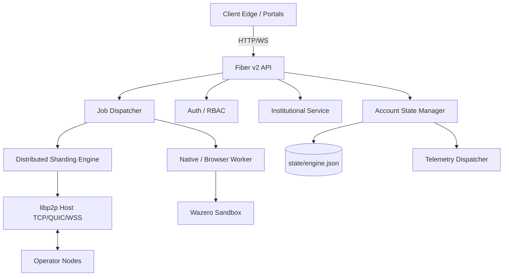
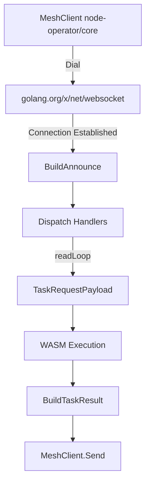
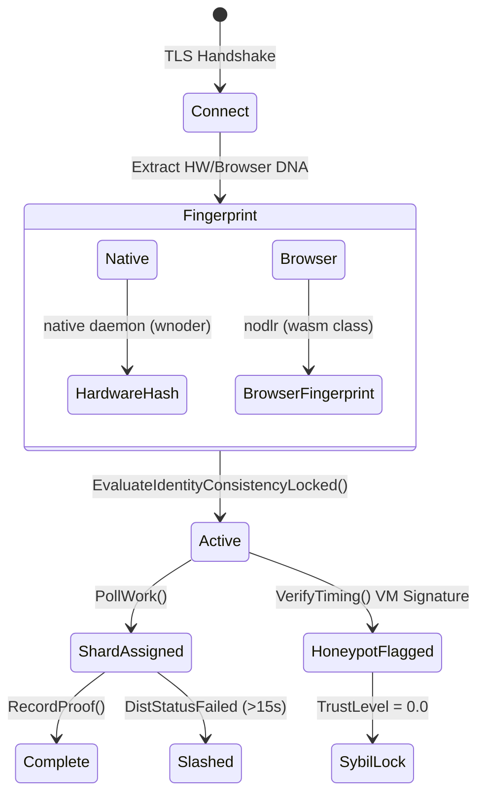
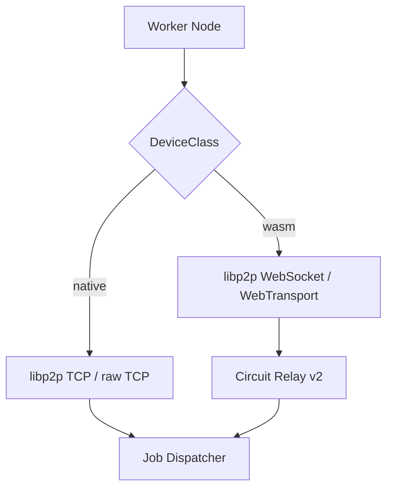
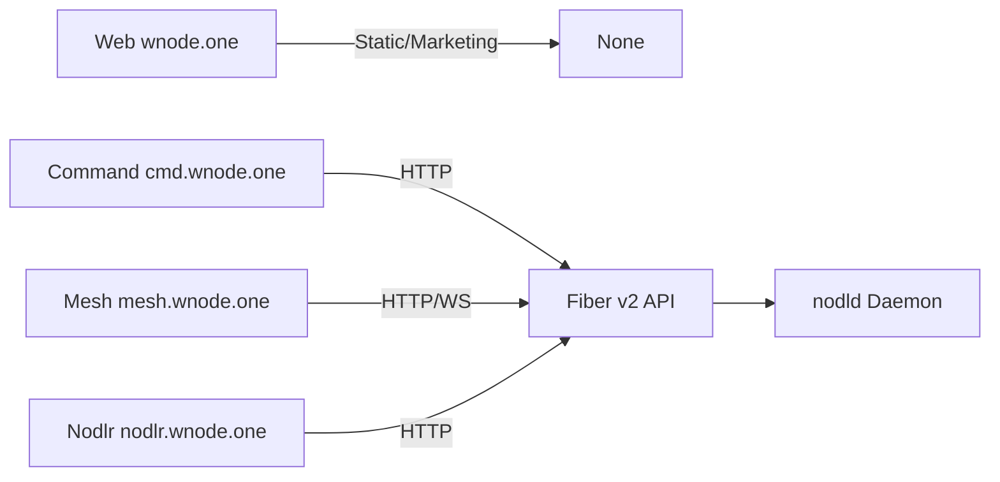
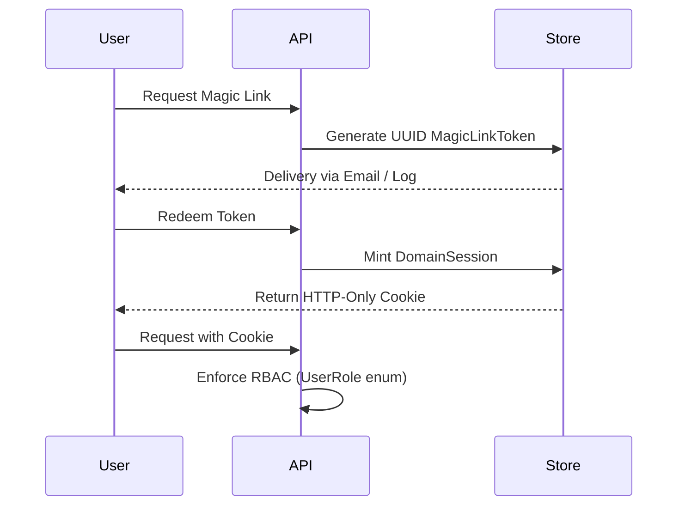
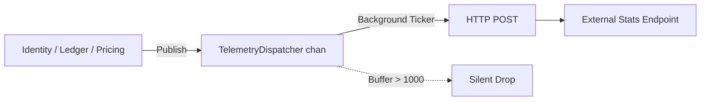
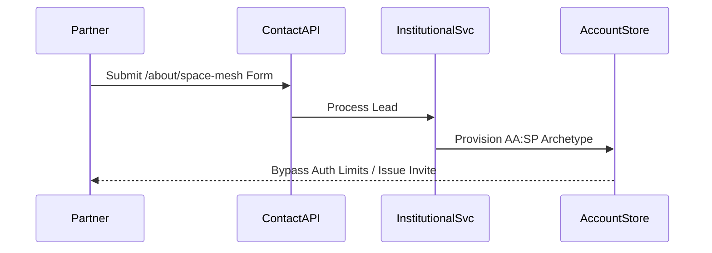
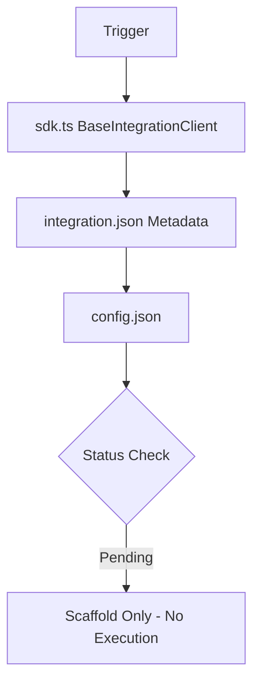
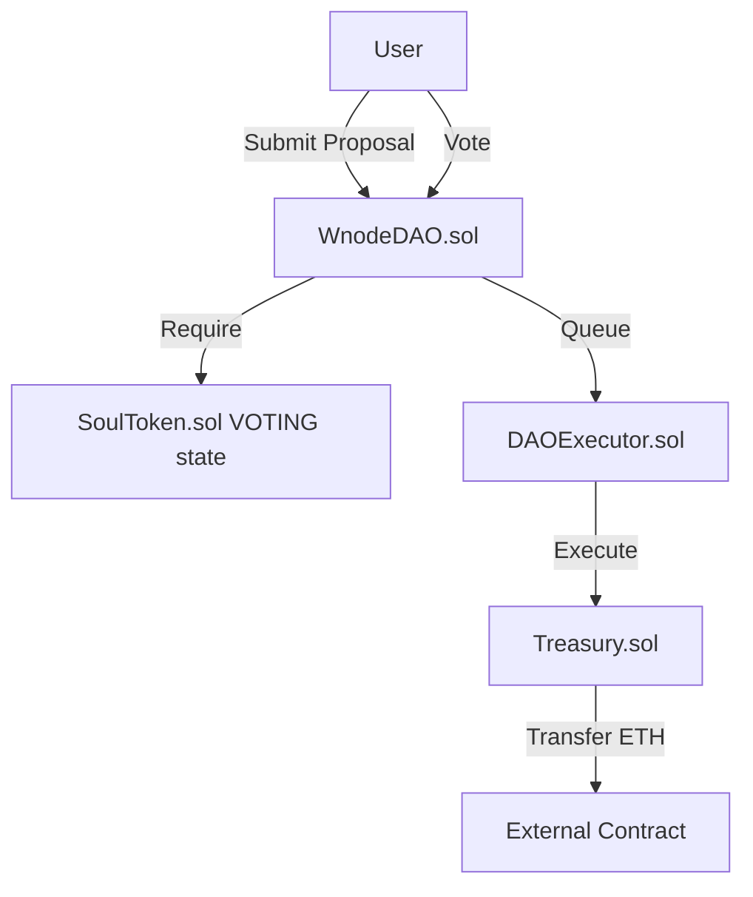

# Enterprise Technical Architecture Audit: Wnode Repository

**Repository:** `wnodeltd/wnode`  
**Stack:** Go 1.22.0, TypeScript/Next.js 15.1.0, Solidity 0.8.20, WebAssembly (wazero)  
**State:** Verified at `HEAD: 3cb432c6d`.  

This document defines implementation details strictly verified at the code level. It omits narrative, marketing language, and undocumented design intentions.

---

## 1. Repository-Verified Architecture Diagrams

### 1.1 Full System Architecture

### 1.2 Mesh Client Execution Pipeline

### 1.3 Node Operator Lifecycle (Native vs Browser)

### 1.4 Native vs Browser Execution

### 1.5 Edge-to-Backend Routing

### 1.6 Authentication & Session Lifecycle

### 1.7 Telemetry Ingestion Pipeline

### 1.8 Space Node Institutional Pipeline

### 1.9 Integration Execution Pipeline (Verified State)

### 1.10 Governance Contract Interactions

---

## 2. Core Subsystems Detailed Audit

### 2.1 Backend Orchestrator (`nodld/`)
- **Structure**: Single Go daemon (`cmd/nodld/main.go`).
- **Initialization Path**: 
  1. `config.Load()` (reads `.env` and OS vars).
  2. `p2p.New()` (initializes host).
  3. `wasm.NewRunner()`.
  4. `forensics.NewStore()`.
  5. `account.NewStore()`.
  6. `jobs.NewDispatcher()`.
  7. API via `srv.Listen(cfg.APIPort)`.
- **Concurrency**: Relies on independent goroutines (`go dispatcher.Run(ctx)`, `go nodeWorker.Run(ctx)`, `go pricingEngine.Run(ctx)`).
- **Configuration**: The `Config` struct enforces `APIPort`/`P2PPort` constraints. Missing Stripe keys are stubbed. 
- **Error Handling**: Graceful shutdown triggered by OS signals invoking `context.CancelFunc()`.

### 2.2 Headless Mesh Client (`node-operator/core/meshclient`)
- **Execution Model**: Operates as a protocol-level WebSocket client (`golang.org/x/net/websocket`) connecting nodes to the `nodld` mesh.
- **Connection Lifecycle**: `MeshClient.Connect()` invokes `dial()`. On failure, `reconnectLoop()` triggers exponential backoff (base `500ms`, max `30s`).
- **Envelopes (`envelopes.go`)**: 
  - `BuildAnnounce()`: Dispatches NodeID, Version, and CPU/GPU/WASM Capabilities.
  - `BuildHeartbeat()`: Dispatches on a 10s ticker containing Uptime and Status.
  - `TaskRequestPayload`: Receives `TaskID`, `Action`, and `Payload`.
  - `BuildTaskResult()`: Returns `ExecutionTimeMs`, `Logs`, and `Output`.
- **Concurrency**: `c.readLoop()` and `c.heartbeatLoop()` run in isolated goroutines, synchronized via `sync.Mutex` on the connection state.
- **Failure Modes**: Missing ACKs trigger `handleDisconnect()`, forcefully closing the socket and initiating the exponential backoff loop.

### 2.3 Node Operator Client (Native vs Browser)
- **Native Daemon (`wnoder`)**: Classified as `DeviceClass == "native"`. Connects via raw TCP over libp2p or the headless MeshClient WebSocket. Identity is pinned to `HardwareHash`.
- **Browser Worker (`nodlr`)**: Classified as `DeviceClass == "wasm"`. Connects via WebRTC Direct or WebTransport over Circuit Relay v2. Identity is pinned to `BrowserFingerprint`.
- **Scoring & Attestation**: Both classes submit proof-of-work. Mismatches in class vs fingerprinting trigger immediate Sybil penalties.

### 2.4 Distributed Sharding Engine (`internal/compute/distributed.go`)
- **Execution Path**: `SubmitJob()` receives a payload array, calculating `baseSize := len(payload) / shardCount`.
- **Node Selection**: Priority routing applies weights: Score > 0.80 (Weight 4), < 0.40 (Weight 1).
- **Goroutines & Locks**: A 10-second `watchdog` goroutine polls `e.jobs` under `sync.RWMutex`. 
- **Error Paths**: If `shard.ActivatedAt` exceeds 15 seconds, it invokes `SlashAbandon()`. A single shard failure transitions the parent job to `DistStatusFailed`.

### 2.5 Job Dispatch & Execution (`internal/jobs/`, `internal/runner/`)
- **Queueing**: Jobs are stored in `jobs.Store` via an in-memory map protected by `sync.RWMutex`.
- **Polling Loop**: `runner.Worker` executes a 2-second ticker calling `pollAndExecute()`.
- **Payload Transport (`jobs/stream.go`)**: Streams apply ephemeral XOR cipher via `NewXORStream(reader, key)`.
- **Proof-of-Work**: Wazero execution returns a `ProofReceipt` with `OutputHash` and `ElapsedMs`.
- **Honeypot Checks (`compute/honeypot.go`)**: `VerifyTiming(elapsedMs)` triggers (<1ms or >500ms), flagging the node for VM emulation.

### 2.6 Identity, Sybil, and Ledger (`internal/account/`)
- **Identity Enforcement (`identity.go`)**: `OperatorIdentity` tracks fingerprints. Mismatches subtract `-0.20`. Exceeding 3 changes in 24h triggers `TrustLevel = 0.0`.
- **Sybil Scanning**: `ScanSybilDuplicatesLocked()` identifies hardware hashes shared across accounts, applying a global `-0.30` penalty.
- **Ledger Invariants (`ledger.go`)**: `CalculateWaterfall(totalCents)` enforces an exact 100% split: Worker (0.84), L2 (0.06), L1 (0.02), Founder (0.03), Platform (0.05).
- **Staking (`staking.go`)**: `LockStake()` requires 2.0 available tokens. `SlashAbandon()` burns 5.0 tokens multiplied by the operator's severity factor.

### 2.7 WASM Sandbox (`internal/wasm/`)
- **Engine**: `wazero` (v1.8.2).
- **Boundaries**: Absolute zero-IO isolation. No pre-opened directories (`fs.Config()`), no network sockets. `wasi_snapshot_preview1` strictly handles clock and randomness.

### 2.8 Authentication & Access Control (`internal/api/auth.go`)
- **Session Types**: `MagicLinkToken` (ephemeral authentication), `DomainSession` (long-lived HTTP cookie), `InviteToken` (authoritative onboarding).
- **RBAC Enforcement**: The `Nodlr` struct contains a `Role` enum. Handlers enforce access via middleware parsing the `DomainSession` UUID.

### 2.9 Telemetry & Forensics Pipeline (`internal/account/telemetry.go`, `forensics/`)
- **TelemetryDispatcher**: Subsystems invoke `Publish(&TelemetryEvent{})`. Events enter a buffered channel (`chan *TelemetryEvent, 1000`).
- **Data Flow**: A background goroutine reads the channel, executing a non-blocking `http.Client.Do(req)`. Full queues silently drop events.
- **Forensics Store**: Implements HMAC-SHA256 event signing over `ActionPayload`, `ActorID`, and salted `IPHash`.

### 2.10 Space Node Institutional Pipeline (`internal/institutional/`)
- **Archetype Handling**: Defines `AA:SP` (Space Provider) in `model.go`.
- **Execution Path**: Web form payload routed to `contact/handler.go` -> `institutional/service.go`. Creates isolated `CRMRecord` and overrides standard Sybil checks for satellite IP backhauls.

### 2.11 Integrations (`integrations/`)
- **Status**: 100% Scaffold-only.
- **Contents**: 616 directories containing `integration.json` (`"Pending"` status) and generic `sdk.ts` implementations extending `BaseIntegrationClient`.

### 2.12 Smart Contracts (`DAO/`, `wenode-hardhat/`)
- **Asset**: `WENODE.sol` (WEX) implements standard OpenZeppelin ERC-20 with a fixed 10,000,000 supply minted to the deployer.
- **Governance**: `SoulToken.sol` issues ERC-721 identity tokens (`LOCKED`, `VOTING`, `FROZEN`). `WnodeDAO.sol` strictly permits proposal submissions and votes from `VOTING` addresses. `DAOExecutor.sol` and `Treasury.sol` process executed payloads.

### 2.13 Portals & Deployment Stack
- **Portals (`apps/`)**: Next.js 15.1.0 SSR/SSG apps (`web`, `command`, `mesh`, `nodlr`). Act exclusively as UX thin clients issuing `fetch` requests to `nodld`.
- **Deployment**: `docker-compose.yml` orchestrates `nodld`, Next.js apps, and `redis:7-alpine`. Redis is **not imported or used** in the Go backend.
- **Persistence**: Relies exclusively on `state/engine.json`. Debounced `SaveState()` calls marshal the entire `account.Store` into a single file via `sync.RWMutex`.

---

## 3. Subsystem Completion Matrix

| Subsystem | Implementation Status | Notes |
|---|---|---|
| API Orchestrator (Fiber) | Fully Implemented | 131 handlers, complete routing |
| Headless Mesh Client | Fully Implemented | Exponential backoff, WS envelopes |
| Native / Browser Operators | Fully Implemented | Differentiated class attestation |
| WASM Sandbox (Wazero) | Fully Implemented | Zero-IO boundaries verified |
| Economic Ledger | Fully Implemented | Exact 100% waterfall verification |
| Telemetry Dispatcher | Fully Implemented | Asynchronous buffer queue |
| Authentication & RBAC | Fully Implemented | Magic links, domain sessions |
| Pricing Engine | Fully Implemented | Autonomous IQR/SMA algorithm |
| P2P Networking (libp2p) | Fully Implemented | DHT active; ConnectionGater |
| Identity & Sybil | Fully Implemented | Fingerprinting, spoof locks |
| Distributed Sharding Engine | Fully Implemented | Active; watchdog penalization |
| Space Node Integration | Fully Implemented | CRM Intake APIs, AA:SP provision |
| Portals (Next.js) | Fully Implemented | UI active; logic deferred to backend |
| DAO Smart Contracts | Fully Implemented | Deployed to testnet; modifier checks |
| Protocol Integrations (616) | Scaffold-only | Metadata stubs only; zero execution |
| Persistent Database | Not Present in Repo | Uses volatile JSON file writes |

---

## 4. Reviewer Notes & Architectural Analysis

### 4.1 Strengths
- **WASM Security**: The implementation of `wazero` successfully achieves absolute host isolation.
- **Resilient Mesh Client**: The exponential backoff implementation inside `node-operator/core/meshclient` robustly handles edge disconnections without deadlocking the process.
- **Economic Invariants**: The 6-tier ledger split enforces zero value leakage. Staking penalties mathematically guarantee slashing alignment.

### 4.2 Architectural Risks & Failure Modes
- **JSON Persistence Bottleneck**: Marshaling the entire `account.Store` to a single disk file is unscalable. A crash during serialization risks total state corruption.
- **Single Point of Failure**: Lack of Redis/Postgres usage makes `nodld` stateful and impossible to horizontally scale.
- **Brittle Sharding**: `DistributedEngine` fails a parent job if any single shard times out (>15s). There is no DAG-based failover or retry queue.
- **Telemetry Saturation**: The `chan *TelemetryEvent, 1000` queue drops events silently when saturated, rendering audit trails unreliable under heavy load.

### 4.3 Future Work & Missing Components
- **Database Migration**: Immediate replacement of `engine.json` with an ACID-compliant RDBMS (PostgreSQL) and usage of the dormant Redis container for pub/sub queueing.
- **Integration Activation**: Transitioning the 616 metadata scaffolds into functional RPC endpoints.
- **Connection Hardening**: Implementing IP blocklists and peer reputation checks inside `network/gater.go`.
