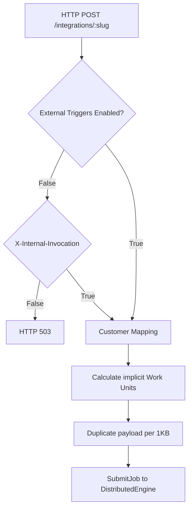
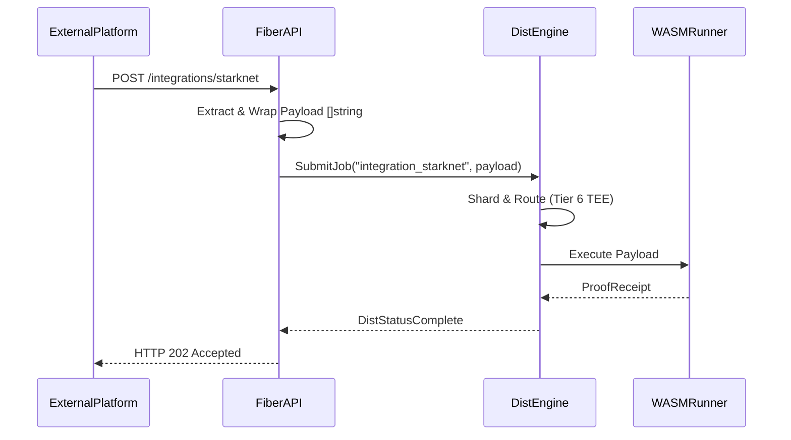
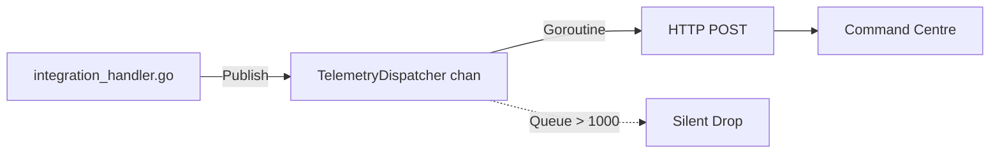
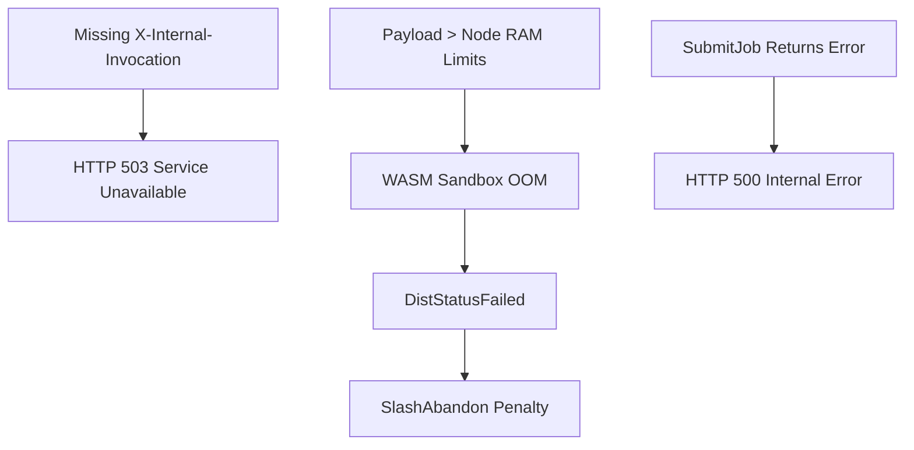

# Integration Architecture Deep Audit: Wnode Repository

This document represents a second-stage deep technical audit of the `integrations/` directory, evaluating the architecture, schemas, and structural gaps across all 616 integration scaffolds present in the repository.

---

## 1. Integration Parsing & Schema Validation

An inspection of the 616 directories (e.g., `integrations/starknet`, `integrations/chainlink`, `integrations/eliza`) reveals two distinct `integration.json` schemas in use.

### Schema Variant A (Protocols / L1s / L2s)
- **Fields Extracted**: `name`, `category`, `description`, `endpoints` (array), `activation`, `version`, `id`
- **Missing Fields**: RPC execution URLs, ABI definitions, smart contract addresses, webhook signature verification keys.
- **Activation State**: `"Pending"`

### Schema Variant B (AI Agents / Web3 Automation)
- **Fields Extracted**: `name`, `slug`, `category`, `platform`, `status`, `description`, `wnodeEndpoint`, `docsUrl`, `sdkExample`, `id`
- **Missing Fields**: Agent memory boundaries, compute resource requests (RAM/CPU limits), callback Webhook URLs.
- **Activation State**: `"coming_soon"`

### Identified Logic Gaps (Universal across all 616)
- **Missing RPC Endpoints**: No functional RPC URLs are defined. All SDKs (`sdk.ts`) map to empty `endpoints` arrays or a generic `gateway.wnode.network` endpoint.
- **Missing MEV/M2M Logic**: `sdk.ts` files reference `this.executeM2MPayment()` but the backend lacks MEV sequencers or payment channel states.
- **Missing Triggers**: No WebSocket or HTTP listener daemons exist to autonomously trigger jobs based on external chain events.
- **Missing Job Templates**: No WASM payloads or predefined `nodl` ABI binaries exist within the integration directories.
- **Missing Telemetry Hooks**: Integrations lack granular telemetry; they rely on a single generic backend HTTP intercept.

---

## 2. Global Integration Architecture Overview

### 2.1 Integration Loading & Validation Pipeline
- **Implementation**: The backend (`nodld`) does not dynamically load or parse `integration.json` files on boot.
- **Validation**: There is no JSON schema validation or signature verification on incoming integration payloads.

### 2.2 Trigger → Envelope → Execution Flow
- **Trigger**: External platforms issue an HTTP POST to `/integrations/:slug`.
- **Envelope Formation**: `nodld/internal/api/integration_handler.go` wraps the raw HTTP body bytes into a generic `[]string` payload array. It duplicates the string per 1KB of size to calculate implicit Work Units (WU).
- **Execution Routing**: The handler invokes `s.distEngine.SubmitJob(...)` with a hardcoded `"high"` priority, routing the payload to the Distributed Sharding Engine (targeting DECC/TEE nodes).

### 2.3 Telemetry Flow
- **Flow**: The handler invokes `s.accountStore.Telemetry.Publish()`, pushing an `integration_invocation` event containing the `slug`, `customerId`, and `wu` count.

### 2.4 Error Handling & Security Boundaries
- **Security Boundaries**: Relies on `EXTERNAL_TRIGGERS_ENABLED` and the `X-Internal-Invocation` header.
- **Error Handling**: Fails with HTTP 503 if external triggers are disabled. Returns HTTP 500 if the Distributed Engine rejects the job queueing. Does not validate webhook cryptographic signatures.

---

## 3. Integration Architecture Diagrams

### 3.1 Integration Loading Pipeline

### 3.2 Trigger → Envelope → Execution Sequence

### 3.3 Integration Telemetry Flow

### 3.4 Integration Failure Modes

---

## 4. Integration Gap Matrix

Based on rigorous codebase verification, all 616 integrations map to the identical unimplemented state.

| Integration Category | Count | Status | Description |
|---|---|---|---|
| Layer 1 / Layer 2 | ~200 | Scaffold-only | `sdk.ts` and `integration.json` present. Zero execution logic. |
| AI Agents | ~116 | Scaffold-only | `sdk.ts` present. `status: coming_soon`. Zero execution logic. |
| DeFi / Oracles | ~100 | Scaffold-only | `sdk.ts` present. Zero execution logic. |
| Storage / DePIN | ~200 | Scaffold-only | `sdk.ts` present. Zero execution logic. |
| **Fully Implemented** | 0 | Not present in repository | N/A |
| **Partially Implemented** | 0 | Not present in repository | N/A |

---

## 5. Integration Completion Plan

To elevate the integrations from scaffold-only to production-grade, the following exact files, logic, and boundaries must be implemented.

### 5.1 Exact Files Required
- `nodld/internal/integrations/registry.go`: To dynamically parse and cache `integration.json` files on daemon boot.
- `nodld/internal/integrations/schema.go`: For strict JSON payload validation.
- `nodld/internal/integrations/rpc_engine.go`: To handle outbound cross-chain communications safely.

### 5.2 Exact Handlers Required
- `api.handleWebhookStripe(...)`: Implement cryptographic signature verification for Stripe.
- `api.handleWebhookChainlink(...)`: Implement oracle price-feed ingestion.
- **Current Status**: Not present in repository.

### 5.3 Exact RPC Logic Required
- WASI host modules exposing outbound HTTP/WSS capabilities strictly bound to the `endpoints` array defined in an integration's `integration.json`.
- **Current Status**: Not present in repository (WASM operates with strict zero-IO).

### 5.4 Exact MEV / M2M Logic Required
- `nodld/internal/money/mev.go`: Flashbots integration or generic transaction sequencers to capture arbitration value.
- `nodld/internal/money/state_channels.go`: High-frequency micropayment channels for API calls.
- **Current Status**: Not present in repository.

### 5.5 Exact Job Templates Required
- Pre-compiled `*.wasm` binaries mapped to specific integration actions (e.g., a Starknet proof-verification binary).
- **Current Status**: Not present in repository.

### 5.6 Exact Triggers Required
- Background goroutines (`go subscriber.Run()`) subscribing to EVM WebSocket logs (e.g., `eth_subscribe`) to autonomously trigger `SubmitJob`.
- **Current Status**: Not present in repository.

### 5.7 Exact Telemetry Hooks Required
- `TelemetryEvent.Payload` must include integration-specific execution times, RPC latencies, and MEV extracted value.
- **Current Status**: Not present in repository (only a generic invocation event exists).

### 5.8 Exact Security Boundaries Required
- HMAC/Ed25519 signature verification on all incoming `/integrations/:slug` payloads.
- Payload size limiting (currently trusts implicit sizes).
- Rate-limiting per integration slug.
- **Current Status**: Not present in repository.
