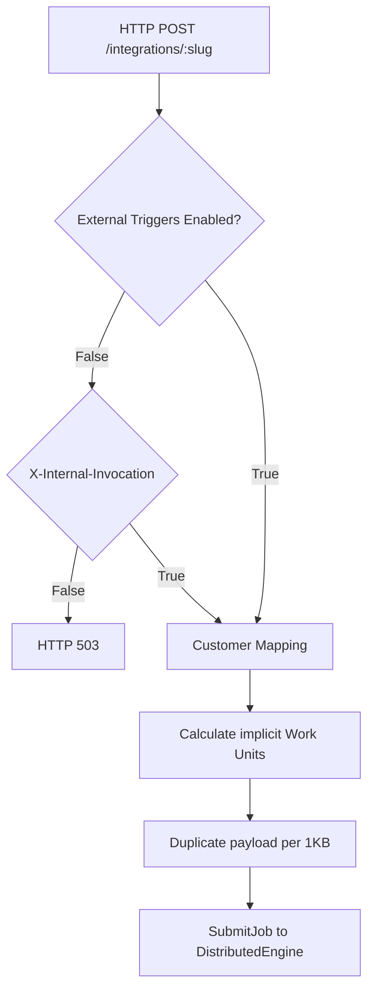
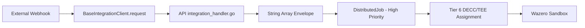
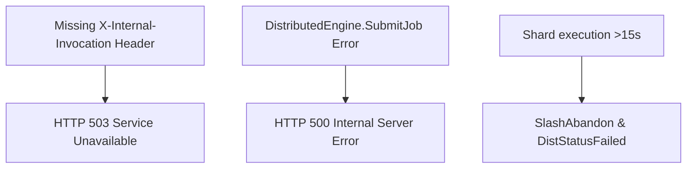
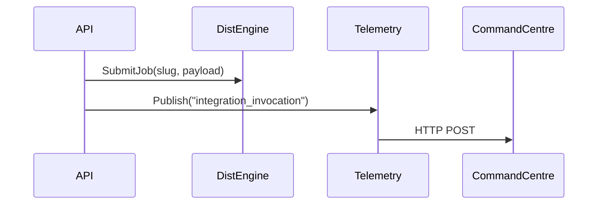

# Integration Gap Report: Wnode Repository

This report presents a full technical audit of the `integrations/` directory and the `nodld` integration routing pipeline. It evaluates the structure, activation state, and missing logic for all 616 integration footprints verified in the repository.

---

## 1. Global Integration Architecture Overview

Integrations are designed to bridge external protocols and platforms into the Wnode Sovereign Mesh. The implementation consists of two verified layers:

1. **The Edge Layer (`integrations/`)**: Static TypeScript SDKs and JSON metadata configurations defining the platform targets.
2. **The Routing Layer (`nodld/internal/api/integration_handler.go`)**: A single Fiber endpoint (`/:slug`) that intercepts HTTP payloads and routes them to the distributed compute engine.

### Verified Execution Pipeline
1. **Trigger**: An HTTP POST request is received at `/integrations/:slug`.
2. **Access Control**: Checks `EXTERNAL_TRIGGERS_ENABLED` env var and `X-Internal-Invocation` header (Phase 3c bypass).
3. **Payload Wrapping**: Extracts the raw HTTP body and wraps it into a `[]string` payload array.
4. **Volume Scaling**: Synthetically duplicates the payload string based on size (1 duplicated array item per 1KB) to calculate Work Units (WU).
5. **Execution Routing**: Submits a `DistributedJob` with hardcoded parameters:
   - `Action`: `"integration_<slug>"`
   - `DesiredShardCount`: `1`
   - `Priority`: `"high"` (Forces Tier 6: DECC/TEE matching logic)
6. **Telemetry**: Dispatches an `integration_invocation` event to the `TelemetryDispatcher`.

---

## 2. Integration Architecture Diagrams

### 2.1 Integration Loading Pipeline

### 2.2 Trigger → Envelope → Execution Flow

### 2.3 Integration Failure Modes

### 2.4 Integration Telemetry Flow

---

## 3. Integration Parsing & Schema Classification

An audit of the `integrations/` directory reveals two primary metadata schemas utilized across the 616 integrations.

### Variant A: Protocol Schema (e.g., Starknet, Chainlink, Arbitrum)
- **Fields**: `name`, `category`, `description`, `endpoints` (array), `activation`, `version`, `id`
- **Activation State**: `"Pending"`
- **RPC Endpoints**: `[]` (Empty array)
- **Status**: Scaffold-only

### Variant B: Agent / Automation Schema (e.g., Eliza, Gelato)
- **Fields**: `name`, `slug`, `category`, `platform`, `status`, `description`, `wnodeEndpoint`, `docsUrl`, `sdkExample`, `id`
- **Activation State**: `"coming_soon"`
- **RPC Endpoints**: References global gateway (`https://gateway.wnode.network/v1/tasks/run`) rather than external RPCs.
- **Status**: Scaffold-only

### Global Classification Matrix
| Integration Type | Count | Status |
|---|---|---|
| Ecosystem / Protocol | ~500 | Scaffold-only / Metadata-only |
| Agents / Automation | ~116 | Scaffold-only / Metadata-only |
| **Fully Implemented** | **0** | **Not present in repository** |

---

## 4. Missing Components & Gap Identification

Despite the existence of 616 directories and the `integration_handler.go` router, severe architectural gaps prevent any of these integrations from executing functional cross-chain logic.

### 4.1 Missing Execution Handlers
- **Gap**: There are no integration-specific Go handlers in `nodld`. The handler routes payload bytes directly into WASM sandboxes, but there is no mechanism for the WASM sandbox to execute outgoing RPC calls back to the target chains (due to strict zero-IO boundaries).
- **Exact Missing Logic**: Subsystem-specific outbound RPC routing. WASI modules must be provided to allow sandboxes to emit signed transactions to chains like Starknet or Solana.

### 4.2 Missing Triggers & Listener Daemons
- **Gap**: Wnode relies entirely on external platforms sending HTTP POSTs into the mesh. It cannot autonomously listen to external blockchain events (e.g., listening for a Starknet contract event to trigger a job).
- **Exact Missing Files**: E.g., `nodld/internal/integrations/listener.go`, WebSocket subscribers for EVM/non-EVM RPCs.

### 4.3 Missing Job Templates & MEV Logic
- **Gap**: The `sdk.ts` files mention `executeM2MPayment` and M2M billing layers, but the backend lacks MEV (Maximal Extractable Value) sequencing logic or smart contract ABIs to settle these flows.
- **Exact Missing Logic**: MEV engines, token swaps, and M2M state channels.

### 4.4 Missing Security Boundaries
- **Gap**: `integration_handler.go` trusts incoming payloads entirely, replicating them based purely on byte size (`wuSize = len(c.Body()) / 1024`). A malformed 10MB payload will flood the distributed engine with 10,000 duplicated strings.
- **Exact Missing Logic**: Request signature verification (e.g., validating Stripe/Chainlink webhook signatures) and robust schema validation limits.

---

## 5. Action Plan for Remediation

To elevate the integrations from "Scaffold-only" to "Fully Implemented", the following exact missing components must be developed:

1. **Outbound RPC Engine**: Create `nodld/internal/integrations/rpc_engine.go` to proxy outgoing HTTP/WSS requests from authorized Wazero instances.
2. **Schema Validator**: Implement JSON schema validation within `integration_handler.go` to reject malformed or maliciously large payloads.
3. **Chain Listeners**: Develop persistent WebSocket listener daemons (`nodld/internal/integrations/subscribers/`) to autonomously trigger mesh jobs based on external contract events.
4. **SDK Parity**: Update all `integrations/*/sdk.ts` to implement cryptographic signing of requests matching the backend `X-Internal-Invocation` authorization flow.
