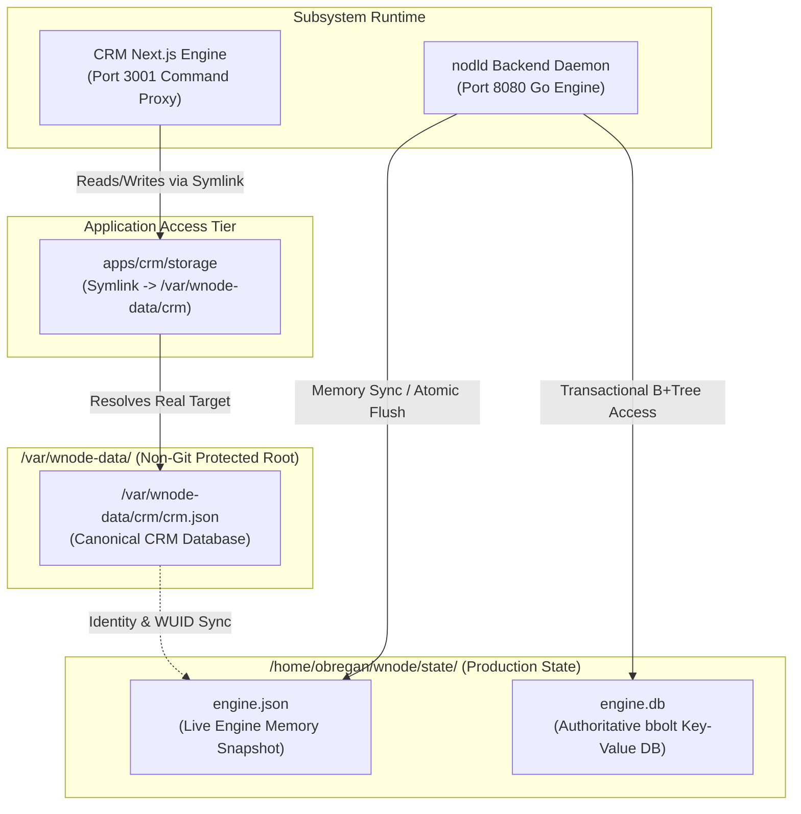
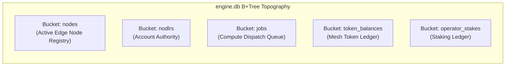
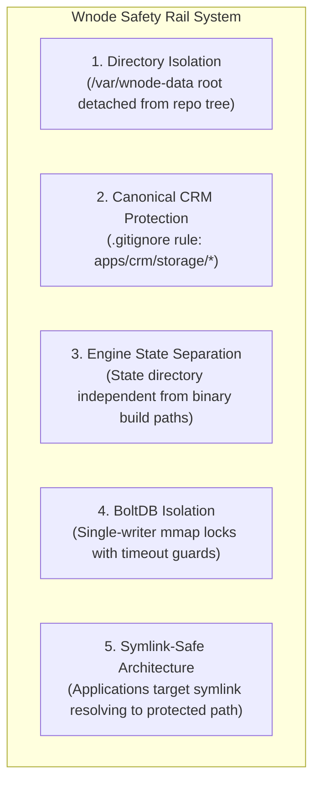
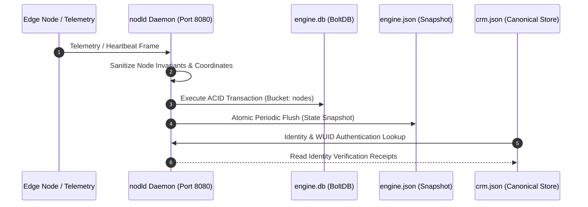
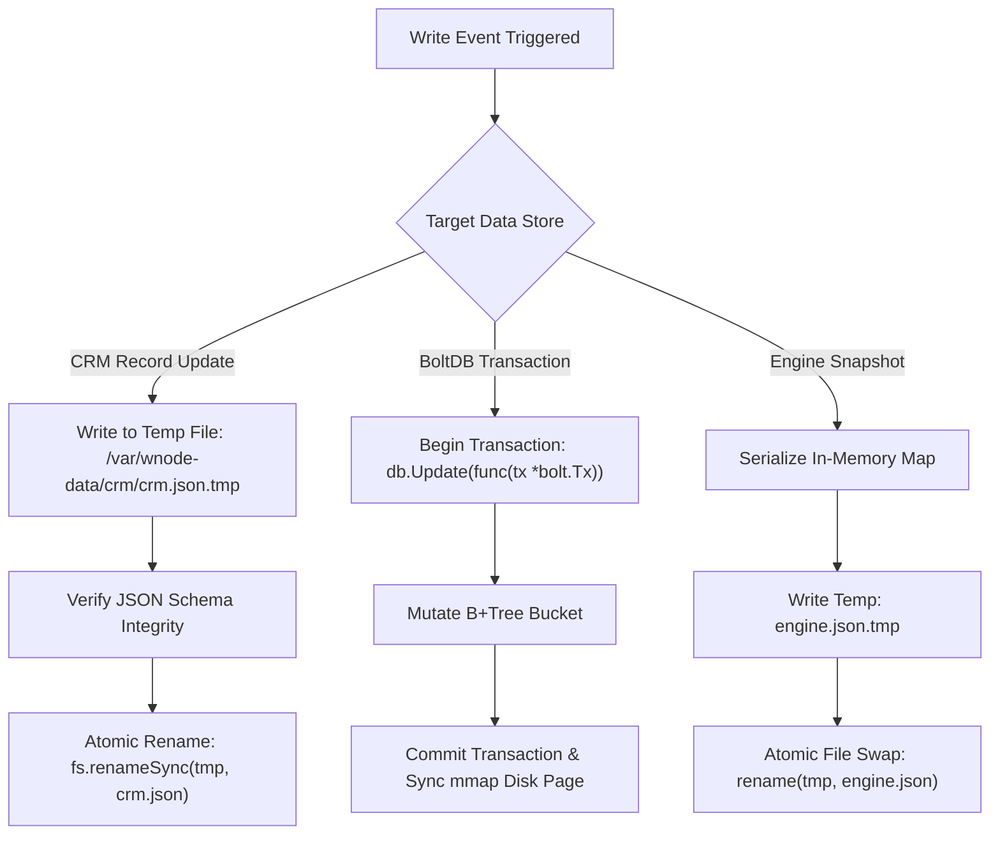

# WNODE DATABASE ARCHITECTURE — CANON SPEC REVISION 2026

> **Canonical Protocol Specification**: Single Source of Truth (SOT) for Wnode Data Storage Architecture, Persistence Layer Invariants, and Isolation Guarantees. Native Go runtime persistence compliance on Port 8080 and Node Operator runtime.

---

## 1. Executive Summary & Storage Topology

The Wnode Sovereign Mesh persistence tier operates a multi-layered, zero-trust state store architecture. State is segregated into capability-isolated storage boundaries, ensuring strict separation between administrative user metadata, telemetry runtime snapshots, and transactional key-value databases.



---

## 2. Authoritative Data Stores

Wnode persistence is governed by three primary, mutually isolated storage artifacts. Each artifact serves a dedicated domain responsibility within the cluster topology.

| Storage Artifact Path | Storage Engine | Subsystem Authority | Invariants & Primary Responsibilities |
| :--- | :--- | :--- | :--- |
| `/var/wnode-data/crm/crm.json` | JSON Structural Document | Canonical CRM Store | Stores protected owner identities, WUID mappings, Stripe account integrations, and operator labels. |
| `/home/obregan/wnode/state/engine.json` | JSON Memory Dump | Live Engine Snapshot | In-memory operational state snapshot containing 5-node telemetry topologies, active heartbeats, and cluster scores. |
| `/home/obregan/wnode/state/engine.db` | `bbolt` Key-Value DB | Authoritative BoltDB | Transactional B+Tree storage for node registries, staking ledgers, session keys, and job dispatches. |

### 2.1 Canonical CRM Store (`/var/wnode-data/crm/crm.json`)

The Canonical CRM Store represents the master directory of record for system operators, founder accounts, and WUID identities. It is stored outside the application deployment directory to guarantee non-ephemeral persistence across application builds and deployments.

```json
{
  "nodlrs": {
    "100001-0426-01-AA": {
      "id": "100001-0426-01-AA",
      "email": "stephen@wnode.one",
      "displayName": "Stephen Soos",
      "role": "owner",
      "status": {
        "active": true,
        "verification": "verified"
      },
      "isProtected": true,
      "isSuperAdmin": true,
      "labels": ["FOUNDER", "NODLR", "MESH"],
      "createdAt": "2026-07-17T13:33:02.210231034Z"
    }
  },
  "metadata": {
    "recoveredAt": "2026-08-27T07:19:29.359Z",
    "recordCount": 2,
    "storageType": "permanent_protected"
  }
}
```

> [!IMPORTANT]
> The directory `/var/wnode-data/` is marked as **System Protected**. Automated builds, deployment cleanup tasks, and Git clean routines are hard-isolated from modifying or traversing this directory.

---

### 2.2 Live Engine Snapshot (`/home/obregan/wnode/state/engine.json`)

The Live Engine Snapshot is generated by `nodld` daemon flushes on Port 8080. It represents the real-time operational state of the edge fleet, capturing hardware resources, telemetry timestamps, and coordinate jitter calculations.

```json
{
  "nodes": [
    {
      "id": "HN-d8e60d23",
      "userId": "100001-0426-01-AA",
      "operator_wuid": "100001-0426-01-AA",
      "cpu_cores": 20,
      "memory_gb": 15,
      "lat": 47.1625,
      "lon": 19.5033,
      "ipAddress": "127.0.0.1",
      "status": "active",
      "lastSeen": "2026-08-27T07:31:51.382784146Z"
    }
  ]
}
```

---

### 2.3 Authoritative BoltDB (`/home/obregan/wnode/state/engine.db`)

The Authoritative BoltDB leverages Go `bbolt` to provide ACID-compliant transactional persistence for zero-trust edge dispatches.



---

## 3. Storage Safety Rails & Isolation Layers

Wnode persistence enforces five strict security boundaries to prevent accidental data corruption, git commits of sensitive records, or unhandled file locks.



> [!TIP]
> **Symlink Security Invariant**: Application services interact with `/home/obregan/Documents/nodl/apps/crm/storage`. Operating system file resolvers resolve the path to `/var/wnode-data/crm`. If the symlink is removed, it can be re-created without any loss of underlying state.

---

## 4. Canonical Data Flow Model (2026)

Data flow across Wnode subsystems strictly obeys uni-directional synchronization paths.



### 4.1 Invariant Validation Rules
1. **Coordinates & Telemetry Preservation**: Client-provided latitude and longitude values (`Lat`, `Lon`) are extracted from edge telemetry frames. Loopback default fallbacks are applied only when coordinates are `0.0000, 0.0000`.
2. **Deterministic Identity Resolution**: `WUID` tags (`100001-0426-01-AA`) serve as the canonical primary key joining CRM records, BoltDB staking balances, and telemetry node ownership.

---

## 5. Production-Grade Write Path

To guarantee concurrent safety across async execution workers and multi-process web proxies, all writes to disk follow a production-grade atomic write sequence:



> [!WARNING]
> Direct non-atomic buffer writes (`fs.writeFileSync` without temp swap) to live database files are prohibited. Atomic file swapping prevents partial-page writes during unexpected host process restarts.

---

## 6. Deployment Notes for Operators

### 6.1 Verifying Canonical Storage Integrity
Operators can verify that all storage safety rails are intact by executing the following operational checks:

```bash
# 1. Verify Symlink Resolution
ls -la /home/obregan/Documents/nodl/apps/crm/storage
# Expected Output: /home/obregan/Documents/nodl/apps/crm/storage -> /var/wnode-data/crm

# 2. Inspect Canonical CRM File
cat /var/wnode-data/crm/crm.json | jq .metadata
# Expected Output: { "storageType": "permanent_protected" }

# 3. Check Live Production Engine State
ssh obregan@192.168.1.140 "ls -la /home/obregan/wnode/state/"
```

### 6.2 Disaster Recovery & Mirroring Protocol
To maintain zero-data-loss capabilities, production operator scripts should mirror the three authoritative files:

```bash
#!/usr/bin/env bash
# Official Disaster Recovery Backup Script
SET_DIR="/var/wnode-backup/daily-dr"
mkdir -p "$SET_DIR"

# Copy Authoritative Files
cp /var/wnode-data/crm/crm.json "$SET_DIR/crm.json"
cp /home/obregan/wnode/state/engine.json "$SET_DIR/engine.json"
cp /home/obregan/wnode/state/engine.db "$SET_DIR/engine.db"

echo "[DR SYNC] Backup completed to $SET_DIR"
```

---

*Wnode Sovereign Mesh — Enterprise Documentation Specification Revision 2026.*
