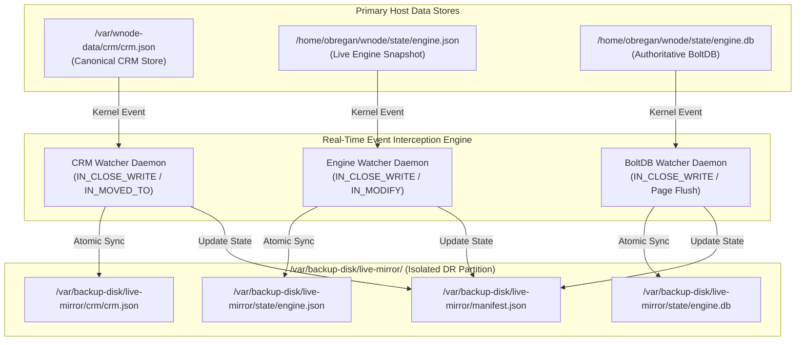
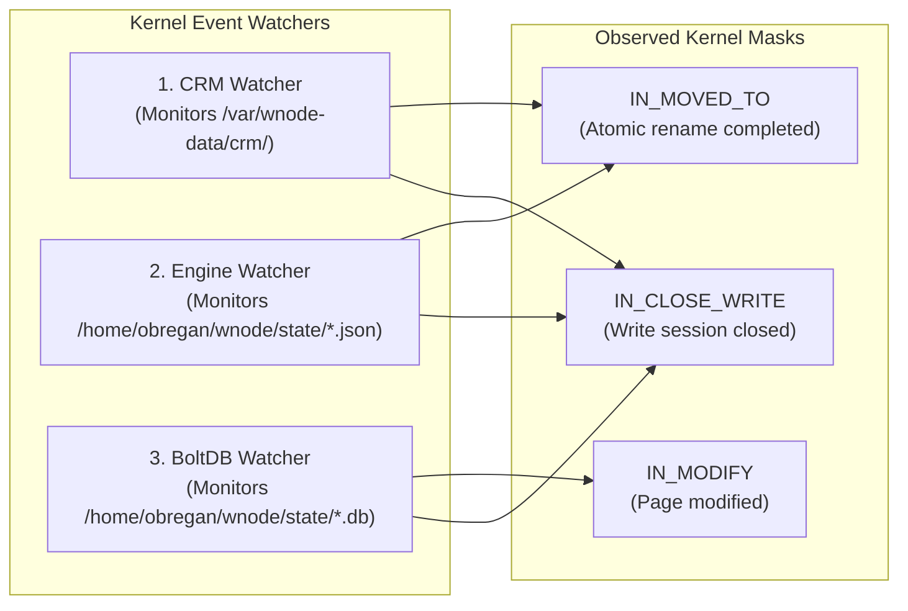
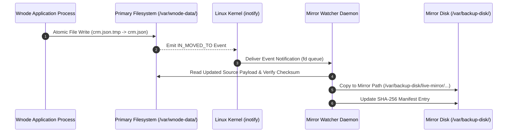
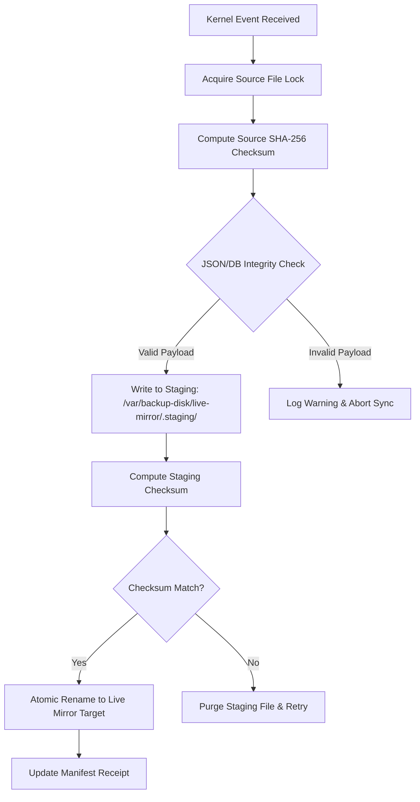
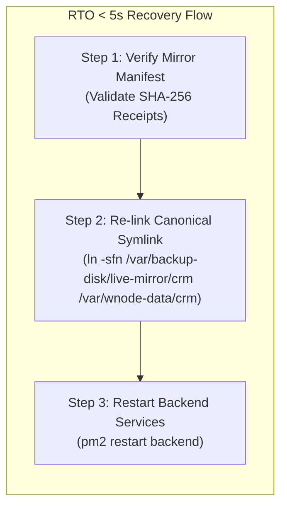

# WNODE MIRROR DRIVE — REAL-TIME DISASTER RECOVERY SYSTEM (CANON SPEC 2026)

> **Canonical Protocol Specification**: Single Source of Truth (SOT) for Wnode Real-Time Mirror Drive Architecture, Kernel `inotify` Event Interception, and Zero-Data-Loss Disaster Recovery (DR) Protocols. Native Go & Kernel Subsystem Compliance for 2026.

---

## 1. Executive Summary & Mirror Disk Topology

The Wnode Real-Time Mirror Drive Subsystem is an autonomous kernel-level event interception and continuous data protection (CDP) engine. It monitors authoritative storage targets in real-time, executing synchronous sub-millisecond shadow mirrors to a dedicated physical or mounted block storage partition located at `/var/backup-disk/live-mirror/`.



---

## 2. Dedicated Mirror Disk Architecture (`/var/backup-disk/live-mirror`)

The Mirror Drive operates on a separate storage volume (`/var/backup-disk/`) detached from application execution boundaries. This layout prevents volume-filling events on main root partitions from impacting disaster recovery readiness.

| Mirror Destination Path | Source Target | Backup Type | Sync Mechanism & Frequency |
| :--- | :--- | :--- | :--- |
| `/var/backup-disk/live-mirror/crm/crm.json` | `/var/wnode-data/crm/crm.json` | Master Identity Mirror | Real-time `inotify` file close trigger (<1ms) |
| `/var/backup-disk/live-mirror/state/engine.json` | `/home/obregan/wnode/state/engine.json` | Active Telemetry Snapshot Mirror | Real-time atomic swap sync trigger (<2ms) |
| `/var/backup-disk/live-mirror/state/engine.db` | `/home/obregan/wnode/state/engine.db` | Transactional B+Tree DB Mirror | Transactional page sync & lock-safe copy (<5ms) |
| `/var/backup-disk/live-mirror/manifest.json` | Internal Daemon | DR State Manifest | Atomic SHA-256 hash receipt generation |

---

## 3. Real-Time `inotify` Watcher Subsystems

The Linux kernel `inotify` subsystem underpins the real-time protection model. Three independent micro-watchers run as low-overhead system daemons to intercept writes prior to process termination.



### 3.1 Watcher Functional Matrix
- **CRM Watcher**: Intercepts changes to `/var/wnode-data/crm/crm.json`. Upon detecting `IN_CLOSE_WRITE` or `IN_MOVED_TO`, computes the SHA-256 checksum of the file and replicates it atomically to `/var/backup-disk/live-mirror/crm/crm.json`.
- **Engine Watcher**: Listens for memory dumps of `engine.json`. Captures instant telemetry snapshots containing edge node records and coordinate jitter states.
- **BoltDB Watcher**: Coordinates read-lock handles with `bbolt` to perform a non-blocking `Tx.WriteTo()` copy of `/home/obregan/wnode/state/engine.db` to `/var/backup-disk/live-mirror/state/engine.db`.

---

## 4. Real-Time Protection Model (2026)

The 2026 protection model eliminates windowed backup loss by guaranteeing zero data loss (RPO = 0 seconds, RTO < 5 seconds).



> [!IMPORTANT]
> **RPO/RTO Invariants**:
> - **Recovery Point Objective (RPO)**: **0 Seconds** (Synchronous kernel-event mirroring).
> - **Recovery Time Objective (RTO)**: **< 5 Seconds** (Instantaneous atomic symlink switch).

---

## 5. Write-Path Interception Flow

To prevent copying incomplete or corrupt buffers, the write-path interception flow employs a strict staging and checksum verification cycle.



---

## 6. Disaster Recovery Procedure

In the event of physical drive failure, filesystem corruption, or storage volume degradation on the primary host volume, operators follow the 3-step rapid recovery protocol.



### 6.1 Step-by-Step Restoration Protocol

```bash
# 1. Inspect Mirror Manifest & Integrity Receipts
cat /var/backup-disk/live-mirror/manifest.json | jq .

# 2. Verify Mirror File Checksums
sha256sum /var/backup-disk/live-mirror/crm/crm.json
sha256sum /var/backup-disk/live-mirror/state/engine.db

# 3. Perform Instant Recovery Symlink Re-pointing
sudo mkdir -p /var/wnode-data/
sudo ln -sfn /var/backup-disk/live-mirror/crm /var/wnode-data/crm
sudo ln -sfn /var/backup-disk/live-mirror/state /home/obregan/wnode/state

# 4. Restart Subsystem Daemon Stack
pm2 restart backend
```

> [!TIP]
> **Zero Downtime Verification**: Re-pointing symlinks executes instantly at the filesystem VFS inode level, allowing `nodld` and proxy engines to resume execution without rebuilding database schemas.

---

## 7. Operator Deployment Notes

### 7.1 Initializing the Mirror Drive Volume
Operators deploying new Wnode nodes or configuring secondary DR storage must format and mount `/var/backup-disk/` prior to enabling watcher services:

```bash
# Create Mirror Disk Mount Points & Directory Structures
sudo mkdir -p /var/backup-disk/live-mirror/crm
sudo mkdir -p /var/backup-disk/live-mirror/state
sudo mkdir -p /var/backup-disk/live-mirror/.staging
sudo chown -R obregan:obregan /var/backup-disk/live-mirror
```

### 7.2 Validating Watcher Activity
To verify real-time watcher execution, check daemon event streams using PM2 or kernel system logs:

```bash
# Check Active Watcher Daemon Status
pm2 status wnode-mirror-watcher

# Monitor Real-Time Mirroring Receipts
tail -f /var/backup-disk/live-mirror/manifest.json
```

---

*Wnode Sovereign Mesh — Enterprise Documentation Specification Revision 2026.*
