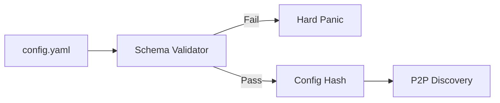

# Configuration Schema

> ### Contextual Architecture Narrative

> - **WHAT**: Core architectural specification for **Configuration Schema** within the Wnode Sovereign Mesh network.

> - **WHY**: Guarantees zero-custody execution, deterministic state verification, and anti-Sybil physical radio anchoring.

> - **HOW**: Executed via SECCOMP-isolated Native Go (`linux-amd64`) modules, validated with mTLS telemetry signatures and HMAC routing epochs.

## 1. Component Overview
The Configuration Schema subsystem strictly types, validates, and propagates environment and YAML configuration settings throughout the daemon lifecycle.

## 2. Architectural Role
The initialization gatekeeper. Nodes will refuse to boot if their configuration breaches strict architectural parameters.

## 3. Change Description (Before vs After)
- **Before**: Loose `process.env` loading with fallback defaults leading to fragmented cluster states.
- **After**: Strict `spec.yaml` with Zod/Go-validator parsing, cryptographically hashed on boot.

## 4. Deterministic Guarantees
Ensures that a node's capabilities and bounds are explicitly known to the network, preventing "silent capability drift."

## 5. Execution Lifecycle
1. Daemon Boot.
2. Load `/etc/nodl/config.yaml`.
3. Validate against strict schema.
4. Hash the sanitized config payload.
5. Broadcast Config Hash during discovery.

## 6. Interfaces & Contracts
- `NodeConfig` struct.

## 7. Invariants & Math
- Values like `concurrency_limit` must be $1 \le C \le 128$.

## 8. Failure Modes & Guarantees
- Invalid config hard-panics the daemon with exit code 1.

## 9. Security & Isolation
- Sensitive variables (e.g., private keys) are omitted from the configuration hash.

## 10. RPC Trust Boundaries
- Defines the `QuorumProviders` array governing external trust.

## 11. Replay Guarantees
- Changes in the config hash force a new Node Session Epoch, invalidating prior pending workflow assignments.

## 12. Slashing Conditions
- Claiming capabilities in the config hash that the node cannot fulfill results in liveness slashing.

## 13. Config & Operator Controls
- Governs `sandbox_memory_mb`, `allowed_egress_ips`, and protocol integration toggles.

## 14. Testing & Validation
- Start-up simulation tests feed 1,000 malformed configs to ensure no panics leak sensitive defaults.

## 15. Architecture Diagrams

## 16. Deterministic Hashing Flow
Sanitized config struct is converted to canonical JSON, keys sorted, sensitive fields omitted, and SHA-256 hashed.

## 17. Deterministic Memory Model
N/A.

## 18. Deterministic ABI Encoding
N/A.

## 19. Deterministic Workflow Scheduling
N/A.

## 20. Deterministic Compute Proofs
The `ConfigHash` is attached to peer routing tables, allowing the scheduler to verify a node's capability claims mathematically.
