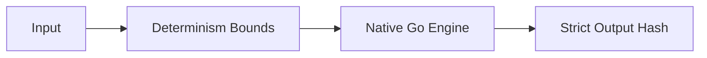

# Determinism Model

> ### Contextual Architecture Narrative

> - **WHAT**: Core architectural specification for **Determinism Model** within the Wnode Sovereign Mesh network.

> - **WHY**: Guarantees zero-custody execution, deterministic state verification, and anti-Sybil physical radio anchoring.

> - **HOW**: Executed via SECCOMP-isolated Native Go (`linux-amd64`) modules, validated with mTLS telemetry signatures and HMAC routing epochs.

## 1. Component Overview
The Determinism Model subsystem governs how the Sovereign Mesh eliminates environmental, architectural, and temporal variances to ensure pure mathematical reproducibility across heterogeneous hardware.

## 2. Architectural Role
Sits underneath the WorkflowEngine, enforcing strict boundary constraints on all inputs, system calls, and external RPCs.

## 3. Change Description (Before vs After)
- **Before**: Time-dependent and float-dependent computations caused state divergence.
- **After**: Implemented `DeterminismClock`, strict WAD/RAY integer math, and block-bound RPC fetches.

## 4. Deterministic Guarantees
Guarantees $f(x) = y$ universally, ensuring that execution hashes match exactly for any given input state block.

## 5. Execution Lifecycle
1. Intercept system time requests (map to block time).
2. Intercept random requests (map to seeded PRNG).
3. Execute Native Go step.
4. Verify execution step hash against quorum.

## 6. Interfaces & Contracts
- `DeterminismClock` interface
- `DeterministicErrorMapper` mapping protocol errors to mesh errors.

## 7. Invariants & Math
- Floating point operations (`float32`, `float64`) are categorically rejected by the ABI encoder.
- Math utilizes exclusively 256-bit big integer WAD (1e18) / RAY (1e27) mechanics.

## 8. Failure Modes & Guarantees
- Nondeterministic execution immediately triggers `NONDETERMINISTIC_RESPONSE`.

## 9. Security & Isolation
- Isolates prevent access to `/dev/urandom` and system wall-clocks.

## 10. RPC Trust Boundaries
- Blocks non-deterministic RPC endpoints (e.g., `eth_pendingTransactions`).

## 11. Replay Guarantees
- A job rerun at block N will securely reproduce the exact step hash of the original execution.

## 12. Slashing Conditions
- Nodes emitting divergent hashes for identical inputs are slashed.

## 13. Config & Operator Controls
- Strict determinism enforcement is locked and cannot be disabled by operators.

## 14. Testing & Validation
- Run across distinct OS architectures (ARM64 vs AMD64) to assert 100% hash parity.

## 15. Architecture Diagrams

## 16. Deterministic Hashing Flow
Input parameters are serialized canonically, stripped of whitespace, and hashed.

## 17. Deterministic Memory Model
Memory allocation traces are ignored in hashing, but out-of-memory limits are deterministic.

## 18. Deterministic ABI Encoding
All values are cast to 256-bit BigInt strings prior to hashing.

## 19. Deterministic Workflow Scheduling
Execution scheduling ignores local compute load, ensuring identical sequence ordering.

## 20. Deterministic Compute Proofs
Produces a `StepHash` verifying the pure deterministic trace.
