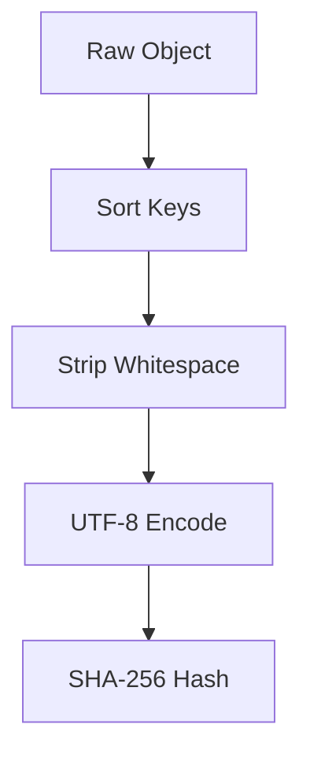

# Hashing Model

> ### Contextual Architecture Narrative

> - **WHAT**: Core architectural specification for **Hashing Model** within the Wnode Sovereign Mesh network.

> - **WHY**: Guarantees zero-custody execution, deterministic state verification, and anti-Sybil physical radio anchoring.

> - **HOW**: Executed via SECCOMP-isolated Native Go (`linux-amd64`) modules, validated with mTLS telemetry signatures and HMAC routing epochs.

## 1. Component Overview
The Hashing Model is the foundational cryptographic rulebook defining exactly how objects, parameters, strings, and structs are serialized before being hashed.

## 2. Architectural Role
Universal utility used by every component (Proof Pipeline, Adapters, Engine, Config) to ensure 100% hash parity across the network.

## 3. Change Description (Before vs After)
- **Before**: Simple `JSON.stringify` causing non-determinism due to key ordering.
- **After**: Strict canonical sorting, whitespace stripping, and recursive hash chaining.

## 4. Deterministic Guarantees
$Hash(A) == Hash(B)$ strictly iff $A$ and $B$ are logically identical, regardless of memory layout or OS.

## 5. Execution Lifecycle
1. Ingest JSON/Struct.
2. Flatten and sort keys alphabetically.
3. Serialize to UTF-8 bytes without whitespace.
4. Execute `SHA-256`.

## 6. Interfaces & Contracts
- `DeterministicHash(payload interface{}) string`

## 7. Invariants & Math
- `null`, `undefined`, and `""` are handled with strict edge-case rules to prevent collision attacks.

## 8. Failure Modes & Guarantees
- Circular object references cause a panic during serialization to prevent infinite loops.

## 9. Security & Isolation
- Hash salts are injected to prevent pre-computation attacks where applicable.

## 10. RPC Trust Boundaries
- Ensures that RPC responses from Geth (which may reorder JSON keys) match Erigon perfectly.

## 11. Replay Guarantees
- Key to the entire replay system functioning.

## 12. Slashing Conditions
- N/A directly.

## 13. Config & Operator Controls
- Non-configurable to prevent network partitioning.

## 14. Testing & Validation
- Fuzzed with thousands of deeply nested, randomly ordered JSON objects to assert zero hash variance.

## 15. Architecture Diagrams

## 16. Deterministic Hashing Flow
The subsystem *is* the hashing flow.

## 17. Deterministic Memory Model
Deeply nested objects are depth-limited to 50 levels during serialization to prevent stack overflows.

## 18. Deterministic ABI Encoding
Used in tandem with ABI encoding for Ethereum payloads.

## 19. Deterministic Workflow Scheduling
N/A.

## 20. Deterministic Compute Proofs
Generates the core identifiers for the `StepHash` and `JobHash`.
