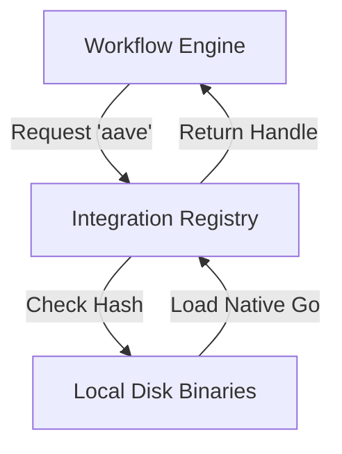

# Integration Registry

> ### Contextual Architecture Narrative

> - **WHAT**: Core architectural specification for **Integration Registry** within the Wnode Sovereign Mesh network.

> - **WHY**: Guarantees zero-custody execution, deterministic state verification, and anti-Sybil physical radio anchoring.

> - **HOW**: Executed via SECCOMP-isolated Native Go (`linux-amd64`) modules, validated with mTLS telemetry signatures and HMAC routing epochs.

## 1. Component Overview
The Integration Registry is the centralized capability index within the node that maps logical integration names (e.g., `aave`, `uniswap`) to their deterministic Native Go/JS execution adapters.

## 2. Architectural Role
Acts as the dynamic linker for the Sovereign Mesh. When a workflow requests a protocol action, the Registry resolves it to the correct, version-locked adapter.

## 3. Change Description (Before vs After)
- **Before**: Hardcoded `switch` statements inside the orchestrator.
- **After**: Dynamic registry populated by canonical `spec.yaml` and hashed adapter modules.

## 4. Deterministic Guarantees
Guarantees that a workflow requesting `aave@v1.1.0` executes the exact cryptographic binary specified by that version hash across all nodes universally.

## 5. Execution Lifecycle
1. Workflow parser requests capability.
2. Registry validates integration existence and version bounds.
3. Registry performs security checks (e.g., `requiresSecrets` vs local config).
4. Registry returns the executable handle to the Sandbox layer.

## 6. Interfaces & Contracts
- `IntegrationRegistry` interface.
- `AdapterSpec` metadata struct.

## 7. Invariants & Math
- Adapter Hashes are strictly immutable once loaded.
- Downgrades are categorically rejected by the bootloader.

## 8. Failure Modes & Guarantees
- If a requested integration is disabled or missing, the workflow is rejected *before* assignment via the P2P scheduler.

## 9. Security & Isolation
- The registry only maps handles; it does not execute them. Execution strictly occurs inside the V8 isolate.

## 10. RPC Trust Boundaries
- The registry defines which adapters are allowed to make `eth_call` requests.

## 11. Replay Guarantees
- Workflows explicitly tag the adapter version hash, guaranteeing the exact same logic is executed years later.

## 12. Slashing Conditions
- Claiming an integration is supported during P2P discovery but failing to locate the binary during execution triggers slashing.

## 13. Config & Operator Controls
- Operators explicitly define allowed integrations in `/etc/nodl/integrations/`.

## 14. Testing & Validation
- Hash parity checks across the official mesh registry API and local disk binaries.

## 15. Architecture Diagrams

## 16. Deterministic Hashing Flow
The Registry strictly verifies `SHA-256(adapter_binary) == expected_hash` on boot.

## 17. Deterministic Memory Model
N/A.

## 18. Deterministic ABI Encoding
N/A.

## 19. Deterministic Workflow Scheduling
The scheduler queries the Registry to verify capability fulfillment before accepting a job.

## 20. Deterministic Compute Proofs
The `AdapterHash` is embedded in the `StepResult` to prove which integration logic generated the state transition.
