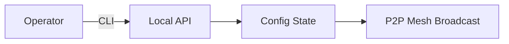

# Operator Controls

> ### Contextual Architecture Narrative

> - **WHAT**: Core architectural specification for **Operator Controls** within the Wnode Sovereign Mesh network.

> - **WHY**: Guarantees zero-custody execution, deterministic state verification, and anti-Sybil physical radio anchoring.

> - **HOW**: Executed via SECCOMP-isolated Native Go (`linux-amd64`) modules, validated with mTLS telemetry signatures and HMAC routing epochs.

## 1. Component Overview
The Operator Controls subsystem defines the APIs, CLIs, and restricted capabilities exposed to the human operators managing individual nodes.

## 2. Architectural Role
Provides local governance. Operators can define hardware thresholds and enable/disable specific protocol integrations without modifying core source code.

## 3. Change Description (Before vs After)
- **Before**: Direct database editing and arbitrary script execution.
- **After**: Strict `nodl` CLI interacting with a localized gRPC/REST API bound by capability tokens.

## 4. Deterministic Guarantees
Operators cannot disable determinism checks or bypass the sandbox. Controls are limited to strictly safe tuning parameters.

## 5. Execution Lifecycle
1. Operator invokes `nodl mesh integration disable aave`.
2. CLI calls local management API.
3. Node updates internal configuration state.
4. Node broadcasts a new `ConfigHash` to the P2P network.

## 6. Interfaces & Contracts
- Local `ManagementAPI` (gRPC/REST bound to `127.0.0.1`).
- `nodl` CLI tool.

## 7. Invariants & Math
- Rate limits applied to configuration changes to prevent gossip-layer flooding (max 1 config update per 5 minutes).

## 8. Failure Modes & Guarantees
- If the Management API crashes, the node continues executing the last known good config.

## 9. Security & Isolation
- Management API binds strictly to `localhost`. Remote access requires explicit SSH tunneling.

## 10. RPC Trust Boundaries
- N/A. Operator controls are strictly local.

## 11. Replay Guarantees
- N/A.

## 12. Slashing Conditions
- Operator negligence (e.g., shutting down during an assigned task) causes Liveness slashing.

## 13. Config & Operator Controls
- Supported actions: toggling integrations, updating hardware limits, viewing local telemetry, and extracting local node keys.

## 14. Testing & Validation
- Comprehensive CLI testing suite ensuring standard UNIX exit codes and predictable behavior.

## 15. Architecture Diagrams

## 16. Deterministic Hashing Flow
Operator actions mutate the `ConfigHash` by enabling/disabling capabilities, which informs the network.

## 17. Deterministic Memory Model
N/A.

## 18. Deterministic ABI Encoding
N/A.

## 19. Deterministic Workflow Scheduling
Changes take effect immediately; however, any *currently executing* workflows will finish under the prior config context.

## 20. Deterministic Compute Proofs
N/A.
