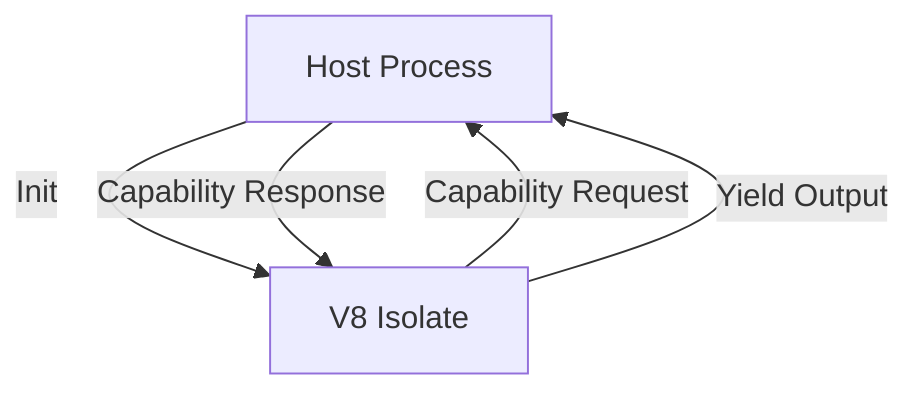

# Sandbox Isolation

> ### Contextual Architecture Narrative

> - **WHAT**: Core architectural specification for **Sandbox Isolation** within the Wnode Sovereign Mesh network.

> - **WHY**: Guarantees zero-custody execution, deterministic state verification, and anti-Sybil physical radio anchoring.

> - **HOW**: Executed via SECCOMP-isolated Native Go (`linux-amd64`) modules, validated with mTLS telemetry signatures and HMAC routing epochs.

## 1. Component Overview
The Sandbox Isolation subsystem provides the secure, deterministic environment where user-defined logic (Native Go or pure JS) executes.

## 2. Architectural Role
The innermost execution core. It heavily restricts I/O, memory, and CPU cycles to guarantee safety and determinism.

## 3. Change Description (Before vs After)
- **Before**: Node.js `vm` module (insufficient isolation).
- **After**: Dedicated V8 isolates via C++ bindings, stripping all Node.js APIs and enforcing hard resource limits.

## 4. Deterministic Guarantees
Eliminates all external variance. Code running inside the sandbox cannot detect wall-clock time, system architecture, or OS.

## 5. Execution Lifecycle
1. Isolate initialization (zero global state).
2. Code injection.
3. Parameter injection.
4. Execution with millisecond watchdog.
5. Isolate destruction.

## 6. Interfaces & Contracts
- `MeshWorker` interface
- `SandboxOptions` configuration

## 7. Invariants & Math
- Execution must halt after `max_execution_ms`.

## 8. Failure Modes & Guarantees
- Infinite loops trigger a hardware-level thread termination (`TerminatedExecutionException`), returning `TIMEOUT`.

## 9. Security & Isolation
- Zero access to `fs`, `net`, `child_process`, `os`.

## 10. RPC Trust Boundaries
- The sandbox cannot make HTTP calls. It must yield a capability request to the host.

## 11. Replay Guarantees
- Perfect isolation ensures that replaying a script yields bit-identical outputs.

## 12. Slashing Conditions
- Attempts to exploit V8 vulnerabilities (if detected by host metrics) flag the workflow for quarantine.

## 13. Config & Operator Controls
- Node operators can configure absolute max RAM per isolate, though protocol defaults apply.

## 14. Testing & Validation
- Tested against known memory-leak patterns, infinite loops, and prototype pollution exploits.

## 15. Architecture Diagrams

## 16. Deterministic Hashing Flow
Sandbox outputs are canonically serialized by the host *after* extraction to prevent internal object-reference hashing issues.

## 17. Deterministic Memory Model
Strict `max_old_space_size` (e.g., 64MB) enforced at the V8 C++ level.

## 18. Deterministic ABI Encoding
N/A internally; host handles ABI.

## 19. Deterministic Workflow Scheduling
Isolate spinning up/down is tracked but does not block the main host event loop.

## 20. Deterministic Compute Proofs
The exact version of the V8 engine is hashed into the execution proof header to ensure version parity.
