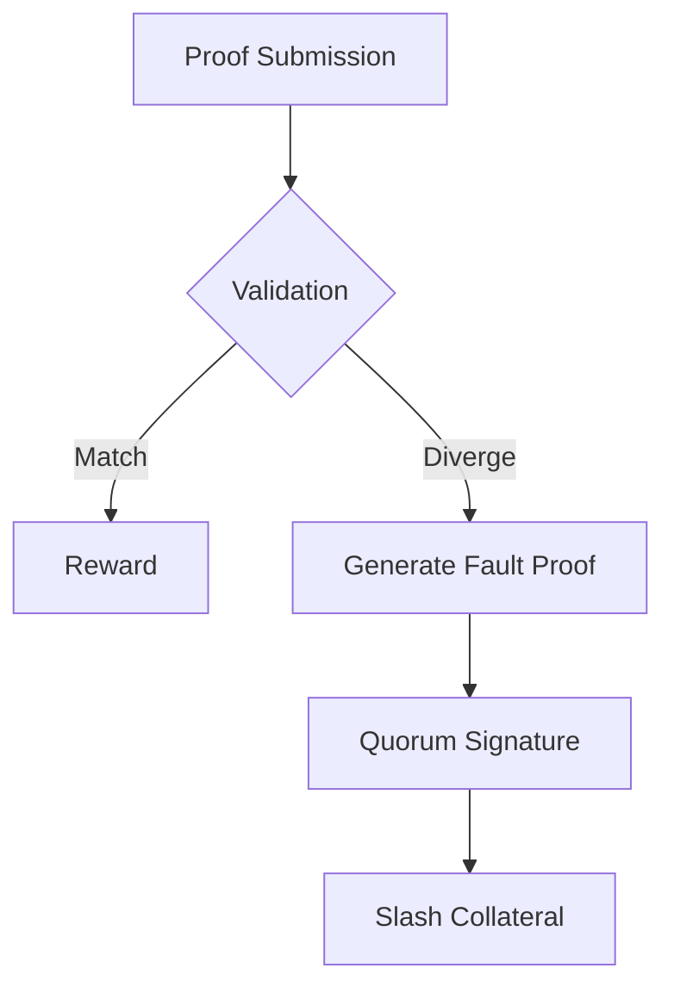

# Slashing Engine

> ### Contextual Architecture Narrative

> - **WHAT**: Core architectural specification for **Slashing Engine** within the Wnode Sovereign Mesh network.

> - **WHY**: Guarantees zero-custody execution, deterministic state verification, and anti-Sybil physical radio anchoring.

> - **HOW**: Executed via SECCOMP-isolated Native Go (`linux-amd64`) modules, validated with mTLS telemetry signatures and HMAC routing epochs.

## 1. Component Overview
The Slashing Engine is the cryptographic enforcer of the Sovereign Mesh, penalizing nodes that emit invalid proofs, breach consensus, or fail to adhere to determinism rules.

## 2. Architectural Role
Sits at the validation layer. It monitors Proofs of Compute against the Replay Engine and the RPC Quorum output.

## 3. Change Description (Before vs After)
- **Before**: Informational error logging; no economic consequences.
- **After**: Cryptographic fault proofs automatically submitted to the settlement layer for collateral confiscation.

## 4. Deterministic Guarantees
Guarantees that malicious or divergent execution is unequivocally provable and punishable without human intervention.

## 5. Execution Lifecycle
1. Node A submits `ProofOfCompute`.
2. Validation Layer initiates challenge via Replay Engine.
3. Replay Engine yields divergent hash.
4. Fault Proof generated.
5. Slashing transaction emitted to network.

## 6. Interfaces & Contracts
- `SlashingEngine` internal module.
- `SlashingManager.sol` smart contract.

## 7. Invariants & Math
- Penalty severity is deterministically calculated: $Penalty = BaseFine \times SeverityMultiplier$.
- Severity $S \in \{1, 10, 100\}$ mapping to Liveness, Equivocation, and Forgery respectively.

## 8. Failure Modes & Guarantees
- Slashing itself is atomic; a node cannot withdraw collateral while a fault proof is pending.

## 9. Security & Isolation
- Slashing logic requires $> 2/3$ quorum signatures to prevent a single malicious validator from slashing honest nodes.

## 10. RPC Trust Boundaries
- Fault proofs include the exact `blockTag` used, meaning the target chain acts as the ultimate arbiter of truth.

## 11. Replay Guarantees
- The fault proof relies heavily on the Replay Engine. If replay matches the proof, the challenger is slashed instead.

## 12. Slashing Conditions
- **Equivocation**: Signing two different states for the same workflow step.
- **Forgery**: Submitting a validly formatted proof with an invalid execution trace hash.
- **Liveness**: Failing to respond to an assigned workflow within the TTL.

## 13. Config & Operator Controls
- No operator configuration. Parameters are managed by protocol governance.

## 14. Testing & Validation
- Extensive adversarial testing in a local devnet using maliciously compiled client nodes.

## 15. Architecture Diagrams

## 16. Deterministic Hashing Flow
Fault proofs hash the original proof signature alongside the divergent correct trace.

## 17. Deterministic Memory Model
N/A.

## 18. Deterministic ABI Encoding
Fault proofs serialize using canonical ABI encoding to interact with EVM settlement contracts.

## 19. Deterministic Workflow Scheduling
Slashing checks occur asynchronously but block reward issuance.

## 20. Deterministic Compute Proofs
Slashing is the inverse of a Compute Proof; it is a Cryptographic Fault Proof.
