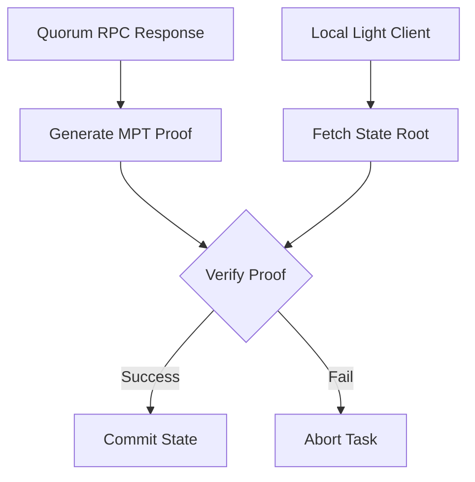

# State-Root Verification

> ### Contextual Architecture Narrative

> - **WHAT**: Core architectural specification for **State-Root Verification** within the Wnode Sovereign Mesh network.

> - **WHY**: Guarantees zero-custody execution, deterministic state verification, and anti-Sybil physical radio anchoring.

> - **HOW**: Executed via SECCOMP-isolated Native Go (`linux-amd64`) modules, validated with mTLS telemetry signatures and HMAC routing epochs.

## 1. Component Overview
The State-Root Verification subsystem anchors the off-chain Sovereign Mesh to the on-chain reality of specific blockchain networks like Ethereum.

## 2. Architectural Role
Sits atop the RPC Quorum Layer, ensuring that aggregated RPC responses match the cryptographically proven state root of a light client.

## 3. Change Description (Before vs After)
- **Before**: Trusted central RPC endpoints (Infura/Alchemy).
- **After**: Decentralized quorum validated against a locally maintained Light Client header sync.

## 4. Deterministic Guarantees
Guarantees that malicious RPC providers cannot feed false data to the Mesh without being mathematically caught.

## 5. Execution Lifecycle
1. Fetch response from Quorum.
2. Query local Light Client for block header $N$.
3. Retrieve `stateRoot` from header.
4. Execute Merkle Patricia Trie verification on RPC payload.

## 6. Interfaces & Contracts
- `LightClientVerifier` interface.

## 7. Invariants & Math
- The MPT proof must mathematically resolve to the exact `stateRoot`.

## 8. Failure Modes & Guarantees
- If verification fails, the node aborts the task with `RPC_INTEGRITY_FAILURE` and avoids processing corrupt data.

## 9. Security & Isolation
- Light Client syncing happens in a separate, isolated thread to prevent workflow blocking.

## 10. RPC Trust Boundaries
- Completely removes trust from RPC providers. Trust is shifted to the Layer 1 consensus protocol.

## 11. Replay Guarantees
- Allows historical replays to fetch the historical state root and verify old RPC mocks mathematically.

## 12. Slashing Conditions
- Emitting a compute proof based on data that fails state-root verification results in maximum slashing.

## 13. Config & Operator Controls
- Operators configure local Light Client peers in `/etc/nodl/config.yaml`.

## 14. Testing & Validation
- Tested by actively corrupting RPC responses during integration test suites and verifying the Light Client catches it.

## 15. Architecture Diagrams

## 16. Deterministic Hashing Flow
N/A.

## 17. Deterministic Memory Model
MPT parsing has specific memory limits to prevent malicious nested tree OOM attacks.

## 18. Deterministic ABI Encoding
Follows exact RLP decoding protocols.

## 19. Deterministic Workflow Scheduling
Blocks execution until Light Client has fully synced the target block.

## 20. Deterministic Compute Proofs
The verified `stateRoot` is signed into the final compute proof to prove exactly which network state was used.
