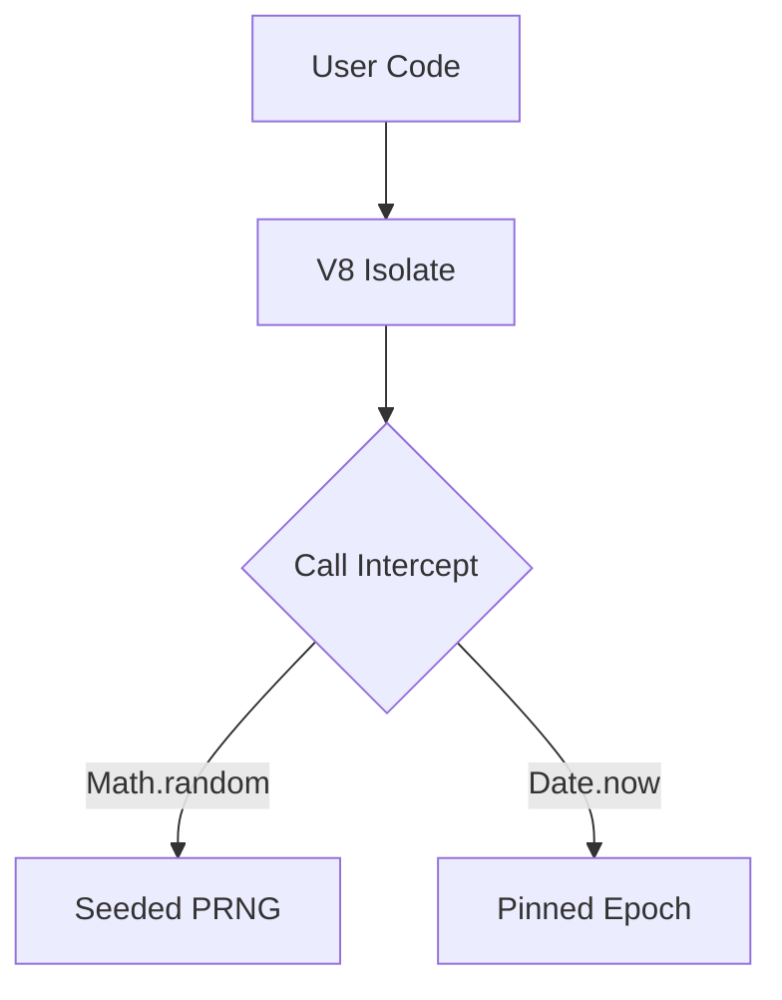

# Workflow Determinism

> ### Contextual Architecture Narrative

> - **WHAT**: Core architectural specification for **Workflow Determinism** within the Wnode Sovereign Mesh network.

> - **WHY**: Guarantees zero-custody execution, deterministic state verification, and anti-Sybil physical radio anchoring.

> - **HOW**: Executed via SECCOMP-isolated Native Go (`linux-amd64`) modules, validated with mTLS telemetry signatures and HMAC routing epochs.

## 1. Component Overview
The Workflow Determinism module defines the strict ruleset applied to all logic paths within the Workflow Engine to prevent state divergence.

## 2. Architectural Role
Acts as a middleware filter that intercepts all inputs, outputs, and system calls made by running workflows.

## 3. Change Description (Before vs After)
- **Before**: Workflows could read local disk and use `Math.random()`.
- **After**: All non-pure JS functions are monkey-patched or removed.

## 4. Deterministic Guarantees
Ensures pure functions only. $y = f(x)$ everywhere.

## 5. Execution Lifecycle
1. V8 Isolate initialization.
2. Inject deterministic polyfills.
3. Freeze global context.
4. Execute user payload.

## 6. Interfaces & Contracts
- `DeterministicV8Context`
- `PolyfillManifest`

## 7. Invariants & Math
- `Math.random` is seeded dynamically by the `JobHash`.
- `Date.now` is pinned to the workflow assignment epoch.

## 8. Failure Modes & Guarantees
- Attempting to bypass polyfills (e.g., via `eval`) triggers immediate `SANDBOX_VIOLATION`.

## 9. Security & Isolation
- Pure V8 isolates; zero access to Node.js built-ins (`fs`, `net`, `child_process`).

## 10. RPC Trust Boundaries
- Internally mocks HTTP calls to route through the secure Quorum layer.

## 11. Replay Guarantees
- Seeding PRNGs by `JobHash` ensures replays generate identical random streams.

## 12. Slashing Conditions
- N/A directly; enforcement is proactive.

## 13. Config & Operator Controls
- Non-configurable by design to prevent operators from breaking determinism.

## 14. Testing & Validation
- Fuzz testing against common non-deterministic JS patterns (e.g., `setTimeout`, `setImmediate`).

## 15. Architecture Diagrams

## 16. Deterministic Hashing Flow
The context injection map is hashed to ensure environment parity.

## 17. Deterministic Memory Model
V8 heap limits are rigidly enforced at 128MB per execution.

## 18. Deterministic ABI Encoding
Object keys are automatically sorted alphabetically before JSON.stringify to prevent V8 key-iteration variations.

## 19. Deterministic Workflow Scheduling
Async microtasks are resolved synchronously at the end of the tick.

## 20. Deterministic Compute Proofs
Environment variables and seed states are encoded into the proof payload.
