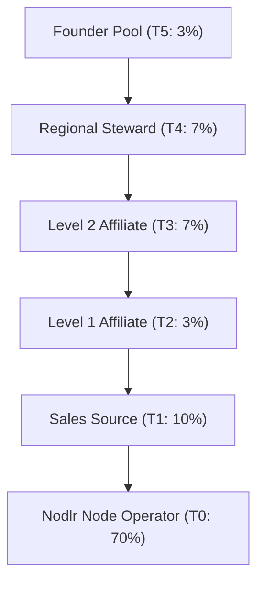

# Wnode Sovereign Affiliate System — Technical & Mathematical Specification (2026 Standard)

A sovereign, multi-tier, DePIN-native affiliate and acquisition graph engineered for high-throughput node growth and deterministic 6-tier revenue distribution.

---

## 1. Overview & Industry Benchmarks

Wnode's Affiliate System is a performance-based revenue distribution model designed to reward node operators, growth partners, regional stewards, and genesis founders who expand the planetary compute and DeWi mesh network.

Unlike legacy single-tier referral bounties, Wnode's model is **DePIN-native** and integrates four established industry paradigms:

1. **Shopify Contracted Economics**: Strict activation rules requiring verified revenue events before commission payout.
2. **HubSpot Recurring Revenue**: Perpetual reward flows tying affiliate income to ongoing network utilization.
3. **Adreva Multi-Tier Virality**: Deep downstream rewards encouraging network building rather than isolated signups.
4. **IoTeX DePIN Verification**: ZK-proof-based hardware execution verification (W3bstream model).


---

## 2. The 6-Tier Revenue Distribution Matrix

Revenue generated from node activity (compute, wireless packet routing, and network bandwidth) is atomically split across six distinct tiers ($\sum_{i=0}^{5} \alpha_i = 1.00$):

| Tier | Role | Symbol | Percentage | Description |
| :--- | :--- | :---: | :---: | :--- |
| **T0** | **Nodlr (Node Operator)** | $\alpha_0$ | **70.0%** | Bare-metal node performing compute, packet routing, and storage. |
| **T1** | **Sales Source** | $\alpha_1$ | **10.0%** | Direct recruiter/entity bringing the node operator into Wnode. |
| **T2** | **Level 1 Affiliate** | $\alpha_2$ | **3.0%** | First upstream affiliate in the acquisition graph (Breadth Incentive). |
| **T3** | **Level 2 Affiliate** | $\alpha_3$ | **7.0%** | Second upstream affiliate in the acquisition graph (Depth Incentive). |
| **T4** | **Steward** | $\alpha_4$ | **7.0%** | Regional/community steward maintaining mesh density & uptime. |
| **T5** | **Founder** | $\alpha_5$ | **3.0%** | Genesis founder pool (`100001-0426-01-AA`) maintaining protocol stability. |

---

## 3. Genealogy Tree Topology (Acquisition Graph)

Every node operator sits within an immutable, directed acyclic 6-tier acquisition graph ($G = (V, E)$):



---

## 4. Mathematical Formulation

### 4.1 Revenue Conservation & Distribution
For any node producing USD revenue $R_{\text{node}}(t)$ on day $t$:

$$P_i(t) = R_{\text{node}}(t) \cdot \alpha_i$$

Where $P_i(t)$ is the payout to tier $i$. Absolute conservation of revenue guarantees zero precision loss or treasury leakage:

$$\sum_{i=0}^{5} P_i(t) = R_{\text{node}}(t) \sum_{i=0}^{5} \alpha_i = R_{\text{node}}(t) \cdot (0.70 + 0.10 + 0.03 + 0.07 + 0.07 + 0.03) = R_{\text{node}}(t)$$

### 4.2 Worked Payout Example ($100 USD Daily Revenue)
For a node generating $R_{\text{node}}(t) = \$100.00\text{ USD}$:

- **Nodlr Operator ($P_0$)**: $\$100 \times 0.70 = \mathbf{\$70.00}$
- **Sales Source ($P_1$)**: $\$100 \times 0.10 = \mathbf{\$10.00}$
- **L1 Affiliate ($P_2$)**: $\$100 \times 0.03 = \mathbf{\$3.00}$
- **L2 Affiliate ($P_3$)**: $\$100 \times 0.07 = \mathbf{\$7.00}$
- **Steward ($P_4$)**: $\$100 \times 0.07 = \mathbf{\$7.00}$
- **Founder Pool ($P_5$)**: $\$100 \times 0.03 = \mathbf{\$3.00}$

---

## 5. Anti-Fraud & Verification Rules

To eliminate fake referrals, sybil nodes, and dormant accounts, upstream commissions activate **only** when the node passes all four formal verification criteria:

$$A(\text{node}) = C \wedge W \wedge I \wedge H \in \{0, 1\}$$

Where:
- $C = 1$: Completed at least **1 verified WASM/Native compute job**.
- $W = 1$: Produced at least **1 DeWi packet routing event**.
- $I = 1$: Completed identity verification (KYC / DID attestation).
- $H = 1$: Maintained continuous **48-hour telemetry heartbeats**.

```
[Node Registration] ➔ [KYC/DID Check (I)] ➔ [48h Telemetry (H)] ➔ [Compute/DeWi Job (C,W)] ➔ [Tiers Activated: A=1]
```

---

## 6. API Endpoint Specification

### 6.1 Get Affiliate Acquisition Tree
- **Endpoint**: `GET /api/v1/affiliates/tree/:wuid`
- **Response**:
```json
{
  "wuid": "wuid-88194ad2a3fffff",
  "tier": 2,
  "parent_wuid": "wuid-99205be3b4fffff",
  "children_count": 14,
  "genealogy": {
    "l1_affiliate": "wuid-11223344",
    "l2_affiliate": "wuid-55667788",
    "steward_region": "us-east-1",
    "founder_pool": "100001-0426-01-AA"
  }
}
```

### 6.2 Get Affiliate Earnings Summary
- **Endpoint**: `GET /api/v1/affiliates/earnings/:wuid`
- **Response**:
```json
{
  "wuid": "wuid-88194ad2a3fffff",
  "total_earnings_usd": 1420.50,
  "breakdown": {
    "sales_source_usd": 850.00,
    "l1_commission_usd": 180.20,
    "l2_commission_usd": 390.30
  },
  "status": "active"
}
```
