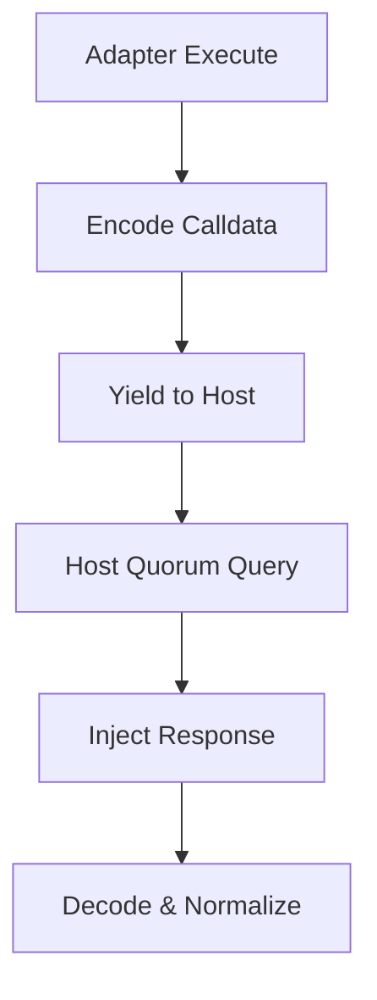

# Adapter Architecture (Protocol Level)

## 1. Component Overview
The Adapter Architecture subsystem defines the structural requirements for individual protocol integrations (e.g., Aave, Uniswap) to operate securely within the Sovereign Mesh.

## 2. Architectural Role
Provides the pure-function translation layer between standard Mesh Workflow schemas and protocol-specific EVM calldata/RPC models.

## 3. Change Description (Before vs After)
- **Before**: Adapters contained ad-hoc HTTP request logic, managing their own retries and latency handling.
- **After**: Adapters are pure logic (WASM/JS). All I/O is yielded to the host orchestrator for Quorum execution.

## 4. Deterministic Guarantees
Adapters cannot produce variance. They receive state strings, and return state strings. All side-effects are banned.

## 5. Execution Lifecycle
1. Adapter invoked with `(Action, Params, BlockTag)`.
2. Adapter encodes RPC payload.
3. Adapter yields to Host.
4. Host performs Quorum RPC at `BlockTag`.
5. Host returns RPC response string.
6. Adapter decodes, applies math logic, returns normalized JSON.

## 6. Interfaces & Contracts
- Canonical Mesh Adapter Interface (`execute(ctx)`).

## 7. Invariants & Math
- Must utilize the canonical BigInt WAD/RAY engine for all fractional logic.

## 8. Failure Modes & Guarantees
- ABI decoding failures must return `ABI_MISMATCH`.
- Mathematical overflows must return `INVALID_PARAMS`.

## 9. Security & Isolation
- Executed strictly within the V8 Sandbox context.

## 10. RPC Trust Boundaries
- Adapters define the *format* of the query. The Host enforces the *integrity* of the query via the Quorum layer.

## 11. Replay Guarantees
- Because the Host handles I/O, replays simply mock the Host yield response, ensuring perfect adapter execution replay.

## 12. Slashing Conditions
- A buggy adapter that generates different hashes on different CPU architectures causes the running node to be slashed. (Hence, rigorous testing requirements).

## 13. Config & Operator Controls
- Adapters read protocol-specific bounds (e.g., Oracle freshness) from host-provided context.

## 14. Testing & Validation
- Requires 100% path coverage via deterministic Jest mocking.

## 15. Architecture Diagrams

## 16. Deterministic Hashing Flow
The adapter's final normalized output is directly responsible for the `payloadHash`.

## 17. Deterministic Memory Model
Adapter execution must fit within the V8 Isolate's 128MB limit.

## 18. Deterministic ABI Encoding
Utilizes `ethers.js` or standard Go ABI tools stripped of non-deterministic random nonce injection.

## 19. Deterministic Workflow Scheduling
N/A.

## 20. Deterministic Compute Proofs
The adapter's unique `id` and `version` are burned into the `StepResult` proof.
