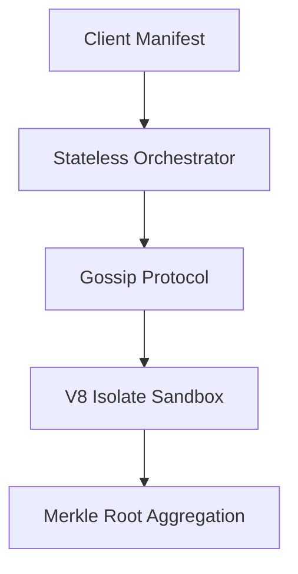

# Backend Architecture

## 1. Component Overview
The Sovereign Mesh Backend Architecture represents the fundamental orchestration layer connecting disparate node operators into a unified, cryptographically verifiable compute mesh. It handles routing, validation, peer-to-peer gossip, and task assignment.

## 2. Architectural Role
Acts as the central nervous system, strictly separating stateless orchestrators from stateful, isolated execution environments (V8 isolates and WASM instances).

## 3. Change Description (Before vs After)
- **Before**: Centralized, stateful orchestrator susceptible to race conditions and non-deterministic routing.
- **After**: Stateless routing validation using signed epochs, capability-scoped execution, and deterministic task scheduling across distributed nodes.

## 4. Deterministic Guarantees
Ensures all node interactions result in identical cryptographic state roots regardless of hardware architecture.

## 5. Execution Lifecycle
1. Manifest Ingestion
2. Epoch Signature Validation
3. Task Assignment (Gossip Protocol)
4. Deterministic Execution Sandbox
5. Result Aggregation & Hashing

## 6. Interfaces & Contracts
- Go `steward-api` REST surfaces
- `spec.yaml` capability definitions
- Protobuf message schemas for P2P gossip

## 7. Invariants & Math
- Monotonic sequence numbers for telemetry replay protection
- Epoch thresholds strictly $> 2/3$ node signatures

## 8. Failure Modes & Guarantees
- Network partition degrades to graceful read-only local execution.
- Orchestrator crash results in stateless recovery via P2P state sync.

## 9. Security & Isolation
- mTLS-secured communication
- Capability-based sandboxing restricting host DB/HTTP calls

## 10. RPC Trust Boundaries
- Untrusted RPC ingestion; requires strict Light Client or Quorum validation.

## 11. Replay Guarantees
- Monotonic clock usage enforces strict replay ordering and prevents double-execution of jobs.

## 12. Slashing Conditions
- Byzantine faults (e.g., forged epoch signatures) trigger immediate stake slashing via `SlashingEngine`.

## 13. Config & Operator Controls
- Operators configure bounds via `config.yaml` (`max_memory`, `allowed_capabilities`).

## 14. Testing & Validation
- Integration tests via `mesh_login_stress_results` and `idempotency.test.ts`.

## 15. Architecture Diagrams

## 16. Deterministic Hashing Flow
Inputs -> ABI Encode -> SHA256 -> HMAC with Epoch Salt.

## 17. Deterministic Memory Model
Strict V8 heap limits (e.g., 128MB) enforcing $O(1)$ memory growth constraints.

## 18. Deterministic ABI Encoding
Forces canonical JSON sorting and prevents integer overflow variations.

## 19. Deterministic Workflow Scheduling
Assigns tasks via deterministic pseudo-random consistent hashing based on node pubkeys.

## 20. Deterministic Compute Proofs
Emits a Merkle Patricia Trie root hash of the execution trace for chain anchoring.
