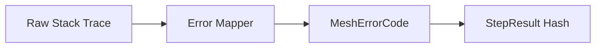

# Error Codes

## 1. Component Overview
The Error Codes subsystem standardizes all failures across the Mesh into deterministic, actionable, and strictly typed categories.

## 2. Architectural Role
Sits between the execution engine, the adapters, and the telemetry sinks, unifying error terminology.

## 3. Change Description (Before vs After)
- **Before**: Untyped strings and raw HTTP stack traces.
- **After**: Strict enum mapping (e.g., `REMOTE_ERROR`, `ABI_MISMATCH`) with explicit retry semantics.

## 4. Deterministic Guarantees
Guarantees that a failure on Node A produces the exact same error code as Node B, yielding identical error-path hashes.

## 5. Execution Lifecycle
1. Error caught by runtime.
2. Error passed to `DeterministicErrorMapper`.
3. Mapped to Mesh Enum.
4. Error Code injected into `StepResult`.

## 6. Interfaces & Contracts
- `MeshErrorCode` enum
- `mapError()` function

## 7. Invariants & Math
- Unknown errors must default to `NONDETERMINISTIC_RESPONSE` to force safe quarantine.

## 8. Failure Modes & Guarantees
- Proper mapping prevents localized network failures (like socket timeouts) from breaking protocol consensus.

## 9. Security & Isolation
- Stack traces are scrubbed before mapping to prevent leaking host filesystem paths into public proofs.

## 10. RPC Trust Boundaries
- Untrusted RPC revert strings are matched against known patterns (e.g., EVM revert codes).

## 11. Replay Guarantees
- Replaying a failed step must generate the exact same `MeshErrorCode`.

## 12. Slashing Conditions
- Claiming `REMOTE_ERROR` when a quorum successfully fetches the data flags the node for potential slashing.

## 13. Config & Operator Controls
- No custom error mapping allowed.

## 14. Testing & Validation
- Regex matching tests ensure all common RPC provider errors correctly funnel into `REMOTE_ERROR`.

## 15. Architecture Diagrams

## 16. Deterministic Hashing Flow
Only the strict string representation of the enum (e.g., `"ABI_MISMATCH"`) is hashed.

## 17. Deterministic Memory Model
Error mapping allocates fixed-size structs to avoid runaway memory from giant error logs.

## 18. Deterministic ABI Encoding
Error codes are serialized as strings in JSON payloads.

## 19. Deterministic Workflow Scheduling
`REMOTE_ERROR` triggers exponential backoff scheduling. `ABI_MISMATCH` triggers immediate abort.

## 20. Deterministic Compute Proofs
Failed steps generate valid proofs of failure containing the `MeshErrorCode`.
