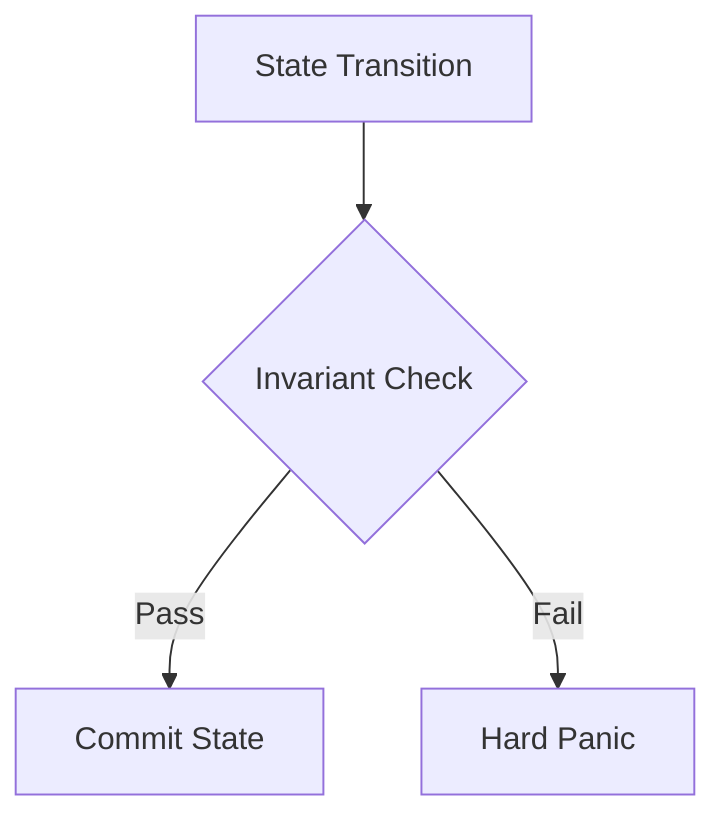

# Invariants

## 1. Component Overview
The Invariants subsystem defines mathematically irrefutable constraints that the Sovereign Mesh relies upon for protocol safety, consensus integrity, and execution determinism.

## 2. Architectural Role
Acts as the ultimate backstop. If any execution path violates an invariant, the process must hard-panic or immediately quarantine the offending data.

## 3. Change Description (Before vs After)
- **Before**: Soft validation logic scattered across the orchestrator.
- **After**: Centralized, mathematically proven constraints running inside the execution and validation tiers.

## 4. Deterministic Guarantees
Guarantees the system never enters an undefined or irreproducible state.

## 5. Execution Lifecycle
1. State Transition Proposal
2. Invariant Assertion Checks
3. Transition Execution
4. Post-Execution Assertion Checks

## 6. Interfaces & Contracts
- `InvariantAssertion` interface (Go)
- `MeshInvariants.sol` (On-chain)

## 7. Invariants & Math
- **Epoch Monotonicity**: $Epoch_{N} > Epoch_{N-1}$ strictly.
- **Quorum Integrity**: Proofs must contain $S \ge \lceil \frac{2N}{3} \rceil$ signatures.
- **Mass Conservation**: In execution, token inputs must equal token outputs + deterministic fees.

## 8. Failure Modes & Guarantees
- Invariant violation results in a `PANIC_INVARIANT_BREACH` and immediate node halt to prevent state corruption.

## 9. Security & Isolation
- Invariants are checked at the host boundary, completely isolated from user WASM code.

## 10. RPC Trust Boundaries
- Invariants apply to internal state; RPC data is sanitized before reaching invariant logic.

## 11. Replay Guarantees
- Invariant checks are strictly identical during replay.

## 12. Slashing Conditions
- Emitting a state transition that demonstrably violates a network invariant triggers maximal slashing.

## 13. Config & Operator Controls
- Not configurable. Hardcoded into the network protocol version.

## 14. Testing & Validation
- Extensive formal verification using TLA+ and bounded model checking.

## 15. Architecture Diagrams

## 16. Deterministic Hashing Flow
Invariant checks themselves do not mutate state and are excluded from the hash payload.

## 17. Deterministic Memory Model
Assertions must execute in $O(1)$ memory.

## 18. Deterministic ABI Encoding
N/A.

## 19. Deterministic Workflow Scheduling
N/A.

## 20. Deterministic Compute Proofs
Implicitly verified by the consensus layer accepting the proof.
