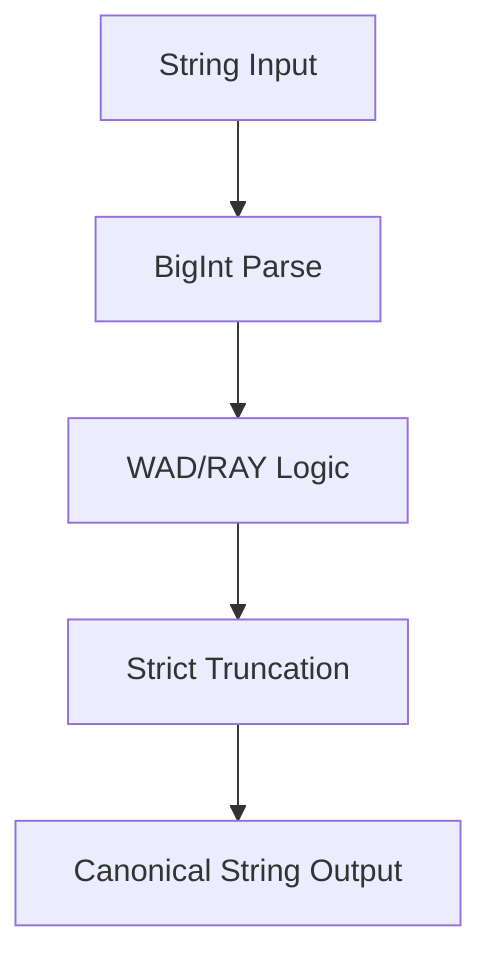

# Math Engine (RAY/WAD)

## 1. Component Overview
The Math Engine is a strictly typed BigInt abstraction used across the Mesh to eliminate floating-point variations when calculating DeFi protocols, fees, and economics.

## 2. Architectural Role
Acts as the standard library for all quantitative calculations. All integrations (like Aave) rely on this engine.

## 3. Change Description (Before vs After)
- **Before**: Unsafe JavaScript `Number` types leading to precision loss.
- **After**: Exact 256-bit BigInt manipulation enforcing EVM-parity RAY/WAD mechanics.

## 4. Deterministic Guarantees
Ensures calculations on a 32-bit system exactly match calculations on a 64-bit system.

## 5. Execution Lifecycle
1. Parameters arrive as canonical decimal strings.
2. Cast to BigInt.
3. Mathematical operations apply strict EVM truncation rules.
4. Serialize back to canonical string.

## 6. Interfaces & Contracts
- `wadMul`, `wadDiv`, `rayMul`, `rayDiv`.

## 7. Invariants & Math
- $RAY = 10^{27}$
- $WAD = 10^{18}$
- Halves are strictly truncated towards zero (no Banker's Rounding).

## 8. Failure Modes & Guarantees
- Division by zero or exceeding 256-bit boundaries causes immediate `INVALID_PARAMS` panic.

## 9. Security & Isolation
- N/A internally; prevents overflow attacks.

## 10. RPC Trust Boundaries
- N/A.

## 11. Replay Guarantees
- Operations are purely mathematical, guaranteeing 100% replay fidelity.

## 12. Slashing Conditions
- Producing a different mathematical output than the quorum triggers slashing.

## 13. Config & Operator Controls
- N/A.

## 14. Testing & Validation
- Extensive unit tests mirror exact output values from Solidity testnets.

## 15. Architecture Diagrams

## 16. Deterministic Hashing Flow
Numbers are hashed as base-10 strings with zero padding removed to prevent formatting variance.

## 17. Deterministic Memory Model
BigInt allocations are tiny and ephemeral.

## 18. Deterministic ABI Encoding
Numbers encode natively to EVM `uint256` boundaries.

## 19. Deterministic Workflow Scheduling
N/A.

## 20. Deterministic Compute Proofs
Implicitly provides the determinism required to form a valid Step Hash.
