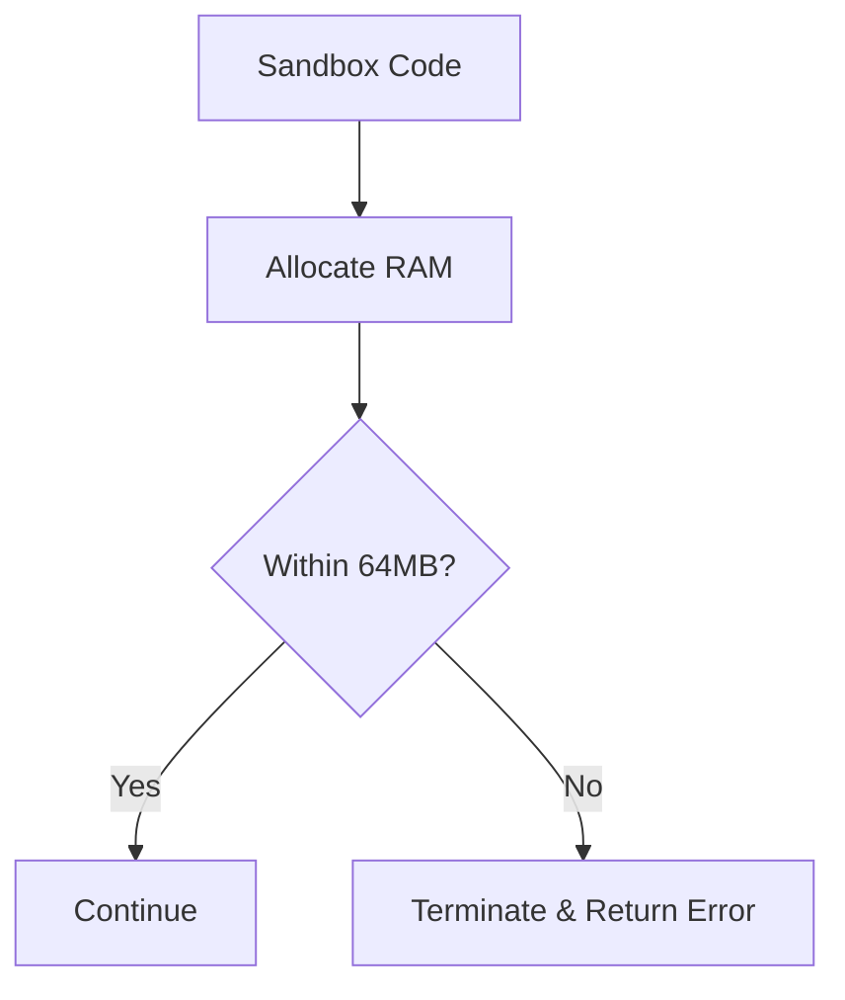

# Memory Model

## 1. Component Overview
The Memory Model defines the strict heap limitations, garbage collection rules, and allocation constraints for the orchestration and execution layers.

## 2. Architectural Role
Protects the mesh from denial-of-service (DoS) via "algorithmic complexity" attacks by bounding memory deterministically.

## 3. Change Description (Before vs After)
- **Before**: Unbounded Node.js processes crashing from OOM under heavy load.
- **After**: Fixed-size V8 isolates and static Go buffer pools.

## 4. Deterministic Guarantees
Guarantees a job will always succeed or always fail with `OUT_OF_MEMORY`, regardless of whether it runs on a Raspberry Pi or an AWS server.

## 5. Execution Lifecycle
1. V8 Isolate initialized with `--max_old_space_size=64`.
2. Memory allocations tracked in C++.
3. If limit breached, Isolate terminates execution synchronously.
4. Error mapped to `OUT_OF_MEMORY`.

## 6. Interfaces & Contracts
- V8 C++ Memory Allocator limits.

## 7. Invariants & Math
- Garbage collection sweeps do NOT impact execution instruction metering, preventing non-determinism.

## 8. Failure Modes & Guarantees
- Guaranteed graceful termination of offending jobs without bringing down the host node daemon.

## 9. Security & Isolation
- Isolates are restricted from interacting with the host heap.

## 10. RPC Trust Boundaries
- Maliciously large RPC responses are truncated at the socket layer (e.g., 2MB max) to protect host memory.

## 11. Replay Guarantees
- Deterministic memory limits ensure that if a script OOMs during live execution, it will strictly OOM during the verification replay.

## 12. Slashing Conditions
- Nodes that bypass memory limits and return success for jobs that should OOM are slashed.

## 13. Config & Operator Controls
- Operators can tune `global_daemon_memory_limit`, but sandbox memory is protocol-defined.

## 14. Testing & Validation
- Tested via "fork bombs" and rapid array allocation scripts designed to aggressively test the OOM killer.

## 15. Architecture Diagrams

## 16. Deterministic Hashing Flow
OOM errors hash as standard error payloads.

## 17. Deterministic Memory Model
The core definition of the system.

## 18. Deterministic ABI Encoding
Limits ABI parsing buffers to prevent nested pointer attacks.

## 19. Deterministic Workflow Scheduling
OOM jobs yield the worker thread back to the scheduler instantly.

## 20. Deterministic Compute Proofs
Yields a valid proof of failure.
