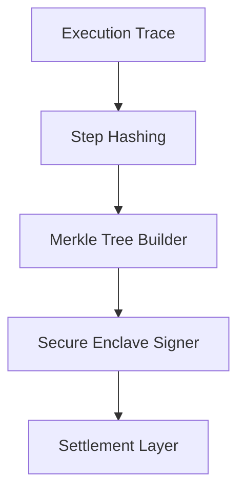

# Proof of Compute Pipeline

## 1. Component Overview
The Proof of Compute Pipeline generates cryptographic receipts verifying that a node accurately executed a deterministic workflow without tampering.

## 2. Architectural Role
The final step in the execution lifecycle; it bridges off-chain execution with on-chain verification contracts.

## 3. Change Description (Before vs After)
- **Before**: Implicit trust model based on basic signatures.
- **After**: Merkle Patricia Trie generation anchoring execution steps to verifiable step hashes.

## 4. Deterministic Guarantees
Produces a singular, immutable cryptographic proof that represents the entire state transition of the execution sandbox.

## 5. Execution Lifecycle
1. Ingest Step Payloads
2. Compute Step Hashes
3. Generate Merkle Leaves
4. Aggregate Root Hash
5. Sign and Emit Proof

## 6. Interfaces & Contracts
- `ProofEmitter` Go interface
- On-chain `Verifier.sol` contract

## 7. Invariants & Math
- Leaves must be strictly ordered canonically before tree construction.

## 8. Failure Modes & Guarantees
- Tree generation failures abort the workflow without committing state.

## 9. Security & Isolation
- Signing keys are held in a secure enclave, completely isolated from the WASM execution context.

## 10. RPC Trust Boundaries
- Proofs are self-contained and do not rely on RPCs for validity after generation.

## 11. Replay Guarantees
- Includes `nonce` and `blockHash` to prevent proof replay attacks on the settlement layer.

## 12. Slashing Conditions
- Submitting an invalid proof to the network results in immediate collateral confiscation.

## 13. Config & Operator Controls
- Operators configure signature models (e.g., Secp256k1 vs Ed25519) via config keys.

## 14. Testing & Validation
- Fuzz testing ensures the Merkle tree construction never panics on malformed inputs.

## 15. Architecture Diagrams

## 16. Deterministic Hashing Flow
Strict SHA-256 cascade from individual opcodes up to the final root.

## 17. Deterministic Memory Model
Pre-allocated buffers for hashing avoid GC spikes and memory fragmentation.

## 18. Deterministic ABI Encoding
Proof serialization follows strict canonical RLP (Recursive Length Prefix) encoding.

## 19. Deterministic Workflow Scheduling
Proofs are generated synchronously after workflow completion to ensure atomicity.

## 20. Deterministic Compute Proofs
This subsystem is the literal engine that outputs the final `ProofOfCompute` struct.
