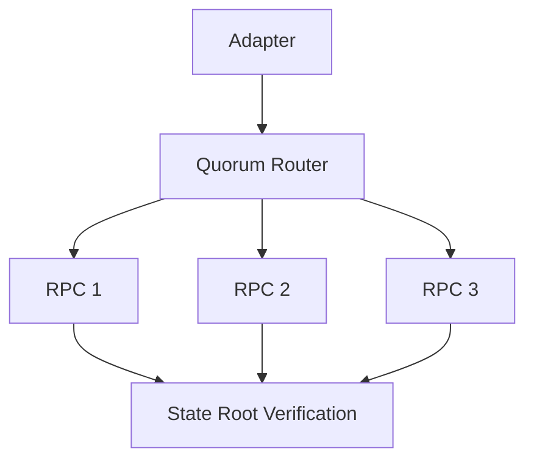

# RPC Quorum Layer

## 1. Component Overview
The RPC Quorum subsystem provides a decentralized mechanism for querying external state (like EVM networks) deterministically by aggregating responses from multiple untrusted providers.

## 2. Architectural Role
Acts as a middleware between Integration Adapters and the external blockchain network, normalizing responses and resolving forks.

## 3. Change Description (Before vs After)
- **Before**: Single RPC provider per node, leading to frequent state divergence during chain reorgs.
- **After**: Multi-provider consensus with Light Client state root verification.

## 4. Deterministic Guarantees
Resolves variable RPC responses (e.g., missing events due to sync lag) into a singular, verifiable truth.

## 5. Execution Lifecycle
1. Broadcast `eth_call` to $N$ configured providers.
2. Await responses bounded by `2000ms` timeout.
3. Compare responses and verify against block state root.
4. Return canonical response or abort via `RPC_INTEGRITY_FAILURE`.

## 6. Interfaces & Contracts
- `QuorumProvider` array in `spec.yaml`

## 7. Invariants & Math
- Requires exact byte-for-byte match from $> 50\%$ of responding providers.

## 8. Failure Modes & Guarantees
- Total provider failure yields `NETWORK_UNAVAILABLE`, initiating a deterministic retry.

## 9. Security & Isolation
- TLS/HTTPS required for all external RPC calls; strictly rate-limited.

## 10. RPC Trust Boundaries
- Providers are fundamentally untrusted until their response matches the Light Client state root.

## 11. Replay Guarantees
- Queries strictly require `blockTag`. `latest` is dynamically resolved and locked before execution.

## 12. Slashing Conditions
- Returning an invalid RPC payload that fails state root validation flags the node for slashing.

## 13. Config & Operator Controls
- Operators define custom `rpc_endpoints` in `/etc/nodl/config.yaml`.

## 14. Testing & Validation
- Integration tests simulate lagging archive nodes and dropped sockets.

## 15. Architecture Diagrams

## 16. Deterministic Hashing Flow
RPC JSON responses are stripped of non-deterministic keys (e.g., `id`) before payload hashing.

## 17. Deterministic Memory Model
Incoming RPC payloads are strictly bounded to prevent heap overflow attacks.

## 18. Deterministic ABI Encoding
Decodes hex responses using strict schema validation to prevent padding variances.

## 19. Deterministic Workflow Scheduling
RPC queries block execution threads; tasks are yielded until quorum is achieved.

## 20. Deterministic Compute Proofs
The `QuorumHash` is appended to the final execution trace to prove network state.
