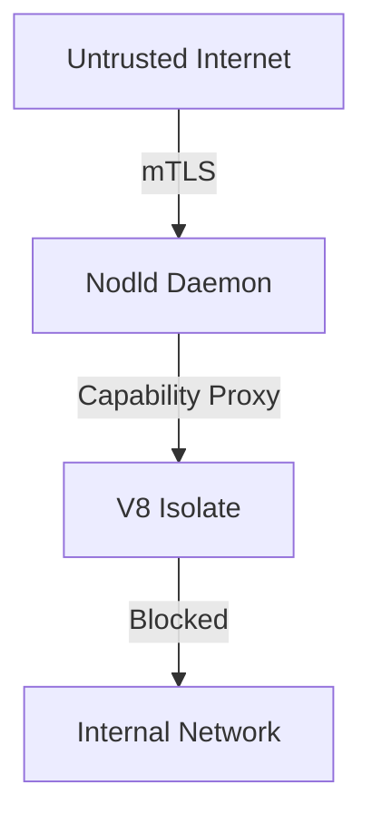

# Security Model

## 1. Component Overview
The Security Model subsystem dictates the trust boundaries, cryptographic enforcement, and threat mitigation strategies for the Sovereign Mesh.

## 2. Architectural Role
A cross-cutting concern applying to network traffic, task execution, data at rest, and peer discovery.

## 3. Change Description (Before vs After)
- **Before**: Implicit trust within the datacenter network.
- **After**: Zero-trust architecture with mTLS, capability-based sandbox execution, and strict slashing rules.

## 4. Deterministic Guarantees
Ensures deterministic cryptographic identities. A node's PubKey strictly defines its identity and permissions.

## 5. Execution Lifecycle
1. Node Bootstraps with secure key.
2. mTLS Handshake for Gossip.
3. Capability Validation before Task Execution.
4. Signature verification on all inputs.

## 6. Interfaces & Contracts
- `mTLS` mesh certificates
- `CapabilityRegistry` logic

## 7. Invariants & Math
- Only Ed25519 signatures are valid for peer-to-peer messages.

## 8. Failure Modes & Guarantees
- Unauthorized access attempts log a security event and drop the socket immediately.

## 9. Security & Isolation
- Full physical and logical isolation between the host orchestration daemon and the V8/WASM isolates.

## 10. RPC Trust Boundaries
- All external traffic is routed through egress proxies restricting IPs to known public RPCs only (preventing SSRF).

## 11. Replay Guarantees
- Strict sequence numbers and epoch nonces prevent replay attacks on network messages.

## 12. Slashing Conditions
- Signature forgery, submitting invalid proofs, and breaching sandbox limits trigger automated slashing.

## 13. Config & Operator Controls
- Operators manage keys via `/etc/nodl/keys/` and configure hardware secure enclaves.

## 14. Testing & Validation
- Automated penetration testing targeting SSRF, memory leaks, and signature manipulation.

## 15. Architecture Diagrams

## 16. Deterministic Hashing Flow
Payload hashes always include the PubKey of the acting entity.

## 17. Deterministic Memory Model
Buffer limits prevent algorithmic complexity (DDoS) attacks.

## 18. Deterministic ABI Encoding
Strict validation drops malformed packets before deserialization.

## 19. Deterministic Workflow Scheduling
Rate limiting prevents malicious submitters from starving the network hash ring.

## 20. Deterministic Compute Proofs
Proofs cannot be forged due to the Merkle-linked cryptographic history of the job.
