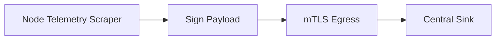

# Telemetry & Metrics

## 1. Component Overview
The Telemetry & Metrics subsystem handles the continuous emission, aggregation, and signing of node health and performance data to the central or decentralized logging sinks.

## 2. Architectural Role
Provides the observability layer required for mesh health monitoring, capacity planning, and Node Operator dashboard rendering.

## 3. Change Description (Before vs After)
- **Before**: Unsigned, spoofable metrics over standard HTTP POST.
- **After**: mTLS-secured, Ed25519-signed telemetry batches with strict monotonic sequence numbering.

## 4. Deterministic Guarantees
Guarantees that metrics emitted from a node (`CPU load`, `RAM used`) definitively originated from that node's securely held private key.

## 5. Execution Lifecycle
1. Scrape host metrics every 5000ms.
2. Aggregate execution traces.
3. Apply `sequenceNumber` and `NodePubKey`.
4. Sign payload.
5. Transmit to sink.

## 6. Interfaces & Contracts
- `TelemetryBatch` Protobuf.

## 7. Invariants & Math
- `sequenceNumber` must strictly increment. Any backwards jump indicates a replay attack or compromised key.

## 8. Failure Modes & Guarantees
- Network partitions buffer telemetry locally up to 50MB. Older telemetry is dropped silently to prioritize node execution resources.

## 9. Security & Isolation
- The metrics thread runs independently from the primary orchestration thread to ensure that telemetry generation never blocks determinism.

## 10. RPC Trust Boundaries
- Telemetry sinks are unprivileged and cannot issue commands to the node.

## 11. Replay Guarantees
- The monotonic counter and epoch identifiers drop any duplicate payload submissions.

## 12. Slashing Conditions
- Spoofing telemetry to fake high performance (if caught via network probe discrepancies) results in permanent node blacklisting.

## 13. Config & Operator Controls
- Operators can configure local Prometheus scrape endpoints in `/etc/nodl/telemetry.yaml` while keeping mesh sinks active.

## 14. Testing & Validation
- Fuzz testing telemetry payload parsers at the sink level to ensure no panic from malformed node data.

## 15. Architecture Diagrams

## 16. Deterministic Hashing Flow
Payload signature uses identical cryptographic standard as the compute proof generation.

## 17. Deterministic Memory Model
Telemetry buffers are pre-allocated rings.

## 18. Deterministic ABI Encoding
N/A.

## 19. Deterministic Workflow Scheduling
Telemetry threads are lowest-priority to prevent stealing compute cycles from WASM sandboxes.

## 20. Deterministic Compute Proofs
N/A. Telemetry is purely observational.
