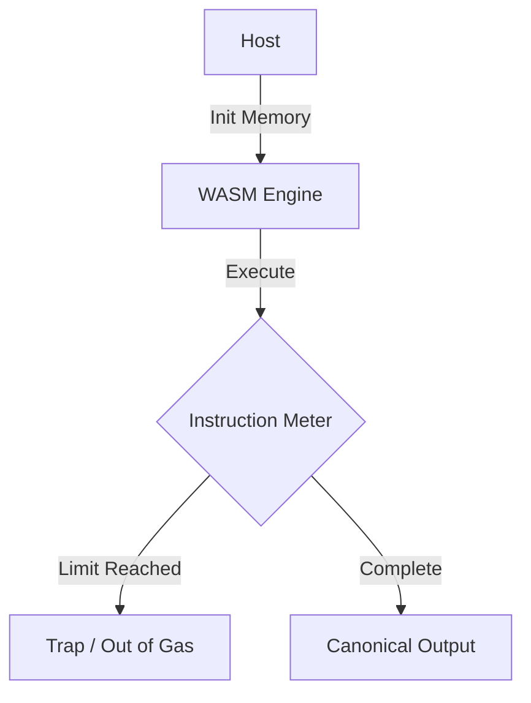

# WASM Execution Model

## 1. Component Overview
The WASM Execution Model governs how WebAssembly modules are instantiated, validated, and safely executed within the node's memory boundaries.

## 2. Architectural Role
Provides the lowest-level execution context for complex compute tasks that require high performance beyond standard V8 Javascript interpretation.

## 3. Change Description (Before vs After)
- **Before**: WASM modules ran with full access to host memory.
- **After**: Strict WASI capabilities, linear memory capping, and gas metering implemented.

## 4. Deterministic Guarantees
Guarantees identical memory allocation and execution trace across all POSIX compliant architectures (AMD64, ARM64).

## 5. Execution Lifecycle
1. Compile WASM binary.
2. Inject restricted WASI host imports.
3. Allocate deterministic linear memory buffer.
4. Execute with CPU cycle metering.
5. Extract output and hash.

## 6. Interfaces & Contracts
- Go `Wasmtime` bindings.
- Restricted `wasi_snapshot_preview1` interfaces.

## 7. Invariants & Math
- Floating point non-determinism (`NaN` payload variance) is canonicalized upon return.

## 8. Failure Modes & Guarantees
- Exceeding the predefined CPU instruction limit causes an immediate trap, returning `OUT_OF_GAS`.

## 9. Security & Isolation
- WASM is mathematically verified for bounds-checking during compilation, preventing arbitrary code execution.

## 10. RPC Trust Boundaries
- WASM cannot make RPCs. It yields execution to the host via imports.

## 11. Replay Guarantees
- Replaying a given WASM binary with identical parameters perfectly mirrors the initial instruction count.

## 12. Slashing Conditions
- Compiling malicious WASM that crashes the host via an exploit results in immediate node slashing and network quarantine.

## 13. Config & Operator Controls
- Operators configure `wasm_max_pages` to constrain RAM overhead.

## 14. Testing & Validation
- Spec tests against the official WebAssembly compliance suite to ensure identical edge-case math.

## 15. Architecture Diagrams

## 16. Deterministic Hashing Flow
The compiled module byte hash is included in the execution proof to prevent execution of tampered payloads.

## 17. Deterministic Memory Model
Memory is fixed to blocks of 64KB (WASM pages), capped strictly to 128MB.

## 18. Deterministic ABI Encoding
WASM interfaces use strict flat-buffer memory offsets for passing pointers instead of complex serializations.

## 19. Deterministic Workflow Scheduling
Execution is preemptable, avoiding blocking the primary host event loop.

## 20. Deterministic Compute Proofs
WASM execution yields an exact `gasConsumed` metric that is verifiable via replay.
