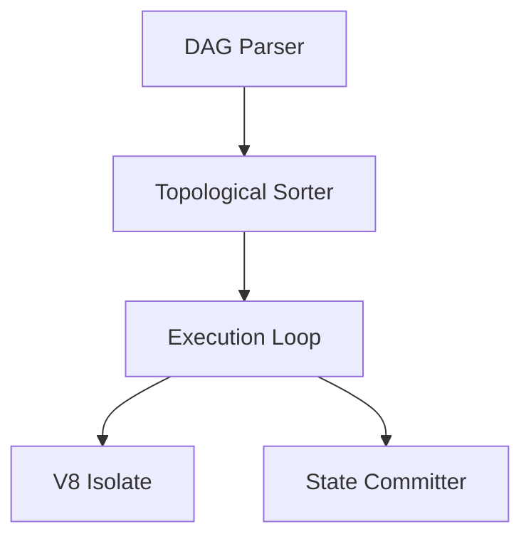

# Workflow Engine

## 1. Component Overview
The Workflow Engine is the core state machine that drives individual job manifests through a strict graph of deterministic steps, validating inputs, executing WASM blocks, and aggregating outputs.

## 2. Architectural Role
Acts as the central execution loop per job. It coordinates with the Scheduler for timing, the Sandbox for execution, and the Quorum Layer for external data.

## 3. Change Description (Before vs After)
- **Before**: Interpreted language scripts running with ad-hoc orchestration.
- **After**: Strict Directed Acyclic Graph (DAG) state machine executing compiled WASM modules.

## 4. Deterministic Guarantees
Guarantees execution order is strictly topological and mathematically immutable given identical inputs.

## 5. Execution Lifecycle
1. DAG Validation
2. Parameter Binding
3. Topological Step Execution
4. Sandbox Invocation
5. State Commitment

## 6. Interfaces & Contracts
- `WorkflowManifest` JSON schema
- `StepResult` Protobuf

## 7. Invariants & Math
- Cycles in the workflow DAG are categorically rejected (Cycle complexity = 0).

## 8. Failure Modes & Guarantees
- Step failure aborts downstream dependents immediately, mapping errors upward.

## 9. Security & Isolation
- The engine itself runs outside the sandbox, but executes untrusted code strictly within V8 isolates.

## 10. RPC Trust Boundaries
- All RPC interactions are delegated out of the engine; the engine itself is purely algorithmic.

## 11. Replay Guarantees
- Given a specific `jobHash`, the engine will execute the exact same path.

## 12. Slashing Conditions
- Emitting invalid state transitions (e.g., claiming a failed step succeeded) triggers node slashing.

## 13. Config & Operator Controls
- `max_steps_per_workflow` bounds execution time.

## 14. Testing & Validation
- DAG cycle detection tested via robust graph unit tests.

## 15. Architecture Diagrams

## 16. Deterministic Hashing Flow
The hash of Step N includes the output hash of Step N-1.

## 17. Deterministic Memory Model
State payloads passed between steps are strictly size-capped.

## 18. Deterministic ABI Encoding
Internal state passing utilizes canonical RLP encoding.

## 19. Deterministic Workflow Scheduling
Yields execution context between steps to prevent thread starvation.

## 20. Deterministic Compute Proofs
Emits the cumulative workflow root hash containing all step proofs.
