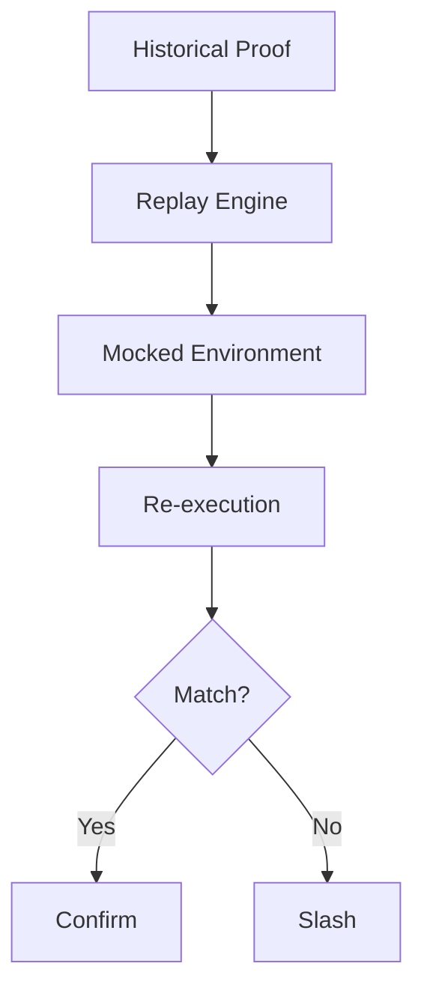

# Workflow Replay Engine

## 1. Component Overview
The Workflow Replay Engine allows network observers and validators to deterministically reconstruct the exact execution state of any historical workflow.

## 2. Architectural Role
Acts as the arbitration core. If a node submits a proof, the Replay Engine allows challenger nodes to verify it.

## 3. Change Description (Before vs After)
- **Before**: Non-existent; state transitions were accepted blindly.
- **After**: Full WASM instruction replay capability with block-bound RPC mocks.

## 4. Deterministic Guarantees
Guarantees 100% bit-for-bit equivalence in execution trace generation given identical initial state bounds.

## 5. Execution Lifecycle
1. Ingest historical `WorkflowManifest` and `BlockTag`.
2. Mock network calls using historical RPC state.
3. Re-execute WASM modules.
4. Compare resulting `MerkleRoot` with the contested proof.

## 6. Interfaces & Contracts
- `ReplayEnvironment` struct
- `MockProvider` interface

## 7. Invariants & Math
- Any temporal variables (e.g. `Date.now()`) are injected statically based on the `BlockTag` timestamp.

## 8. Failure Modes & Guarantees
- Missing historical RPC data causes a deterministic `STATE_UNAVAILABLE` abort, not a validation failure.

## 9. Security & Isolation
- Replay runs in maximum security isolations to prevent malicious payloads from escaping during challenge periods.

## 10. RPC Trust Boundaries
- Replay strictly requires an Archive Node for historical EVM state fetches.

## 11. Replay Guarantees
- Perfect hash reproduction.

## 12. Slashing Conditions
- If the Replay Engine produces a different hash than the submitted proof, the submitter is slashed.

## 13. Config & Operator Controls
- Validators configure archive node endpoints in `config.yaml`.

## 14. Testing & Validation
- Continuous integration pipelines automatically replay workflows from previous software versions to ensure backward compatibility.

## 15. Architecture Diagrams

## 16. Deterministic Hashing Flow
Identical to standard execution flow, ensuring structural parity.

## 17. Deterministic Memory Model
Memory allocation sizes must exactly match the historical run.

## 18. Deterministic ABI Encoding
Same rules as the standard engine.

## 19. Deterministic Workflow Scheduling
Single-threaded, synchronous execution to remove all race conditions during verification.

## 20. Deterministic Compute Proofs
Replay output is a `VerificationReceipt`.
