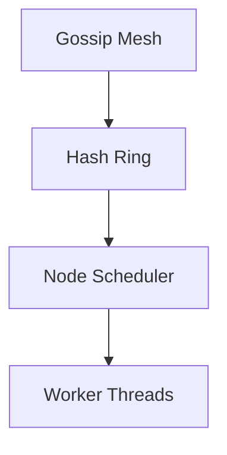

# Workflow Scheduler

## 1. Component Overview
The Workflow Scheduler manages the queueing, prioritization, and assignment of deterministic jobs across the peer-to-peer compute mesh.

## 2. Architectural Role
Sits between the incoming API ingest layer and the execution engine, ensuring fair distribution and load balancing.

## 3. Change Description (Before vs After)
- **Before**: Centralized Postgres-backed queue.
- **After**: Decentralized P2P gossip protocol utilizing Consistent Hashing for job assignment.

## 4. Deterministic Guarantees
Guarantees that job assignment is verifiable; if Node A receives Job X, all nodes can cryptographically verify Node A was the rightful assignee.

## 5. Execution Lifecycle
1. Job Gossiped to Network
2. Pubkey-based Hash Ring Assignment
3. Assignment Acknowledgment
4. Local Execution Queueing
5. Thread Yielding

## 6. Interfaces & Contracts
- `P2PGossip` interface
- `AssignmentHash` schema

## 7. Invariants & Math
- Assignee $N = hash(JobId) \pmod K$ where $K$ is active peers.

## 8. Failure Modes & Guarantees
- If Assignee $N$ times out, deterministic fallback to $N+1$.

## 9. Security & Isolation
- Job manifests are signed by submitters to prevent queue spam.

## 10. RPC Trust Boundaries
- Scheduling does not rely on external RPCs.

## 11. Replay Guarantees
- Re-gossiping the same job results in the exact same assignment map.

## 12. Slashing Conditions
- Stealing jobs (executing without assignment) results in rejected proofs and slashing.

## 13. Config & Operator Controls
- `concurrency_limit` bounds local execution threads.

## 14. Testing & Validation
- Simulation of 10k nodes scaling up and down to test consistent hash stability.

## 15. Architecture Diagrams

## 16. Deterministic Hashing Flow
Hash-ring distance calculation strictly uses `SHA-256`.

## 17. Deterministic Memory Model
Job queue depth is statically bounded to prevent OOM.

## 18. Deterministic ABI Encoding
Gossip payloads are canonically JSON stringified.

## 19. Deterministic Workflow Scheduling
Prioritizes execution based on deterministic fee models (gas limits).

## 20. Deterministic Compute Proofs
The assignment signature is included in the final compute proof to prove legitimacy.
