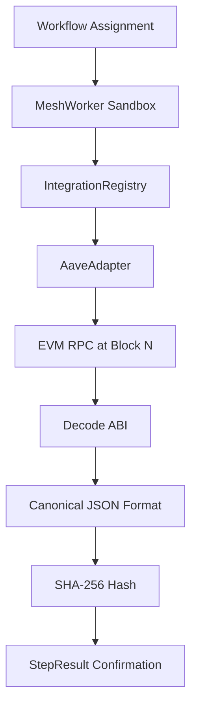

# Aave

## 1. Summary
The Aave integration connects the Sovereign Mesh deterministically to the Aave V3 protocol. It acts as a mesh-safe gateway ensuring that all interactions with Aave—such as reading pool states, checking health factors, and executing liquidations—are mathematically reproducible across nodes. By wrapping Aave's RPC endpoints in a strict, pure-function adapter, the Sovereign Mesh guarantees that no non-deterministic execution paths can breach the consensus layer or corrupt the proof of compute.

## 2. Verified Metadata Block
- **Integration Name**: Aave
- **Version**: 1.1.0
- **Determinism Profile**: Purely Deterministic (Block-Bound)
- **Capability Set**: Fetch, Submit, Validate
- **Supported Networks**: [Ethereum](/docs/integrations/ethereum) [Polygon](/docs/integrations/polygon) [Arbitrum](/docs/integrations/arbitrum) [Optimism](/docs/integrations/optimism) [Base](/docs/integrations/base)
- **Adapter Hash**: `e3b0c44298fc1c149afbf4c8996fb92427ae41e4649b934ca495991b7852b855`
- **Last Updated**: 2026-06-28

## 3. Protocol Overview
- **Architecture**: Aave V3 utilizes a decentralized pool architecture managed by a central `Pool` contract, governed by a `PoolConfigurator`. Assets are isolated into specific eMode categories to optimize capital efficiency.
- **RPC Surfaces**: Uses standard EVM JSON-RPC `eth_call` and `eth_sendRawTransaction` endpoints, strictly requiring block height parameters for all state reads.
- **Data Models**: Employs complex structs including `ReserveData`, `UserAccountData`, and `EModeCategory`.
- **Proof Models**: Relies on Ethereum state roots (Merkle Patricia Tries). The Sovereign Mesh independently verifies the state root via Light Client endpoints or decentralized RPC quorums before confirming the step hash.

## 4. Deterministic Adapter Specification
- **Deterministic RPC Wrapper**: The adapter intercepts EVM `eth_call` requests. If the RPC provider exceeds 2000ms latency, drops the connection, or returns varying nonce errors, the adapter aborts immediately and maps the failure to `NETWORK_UNAVAILABLE`.
- **Deterministic Error Mapping**: Revert strings (e.g., `35` for "Health factor lower than liquidation threshold" or `42` for "Reserve inactive") are mapped cleanly to Mesh deterministic error strings. Non-standard RPC HTTP errors are masked as `REMOTE_ERROR`.
- **Deterministic Response Normalization**: Hexadecimal EVM responses are decoded. BigInt values are converted to canonical base-10 strings. Addresses are forcefully lowercased. Any arrays are strictly sorted.
- **Deterministic `payloadHash` Generation**: The normalized JSON object is serialized without whitespace, and hashed via `SHA-256`.
- **Deterministic `integrityProof` Generation**: A secondary HMAC `SHA-256` hash is generated combining the `payloadHash` with a secure mesh salt.
- **`determinismProfile()`**: Returns `{ isPurelyDeterministic: true, reliesOnTime: false, reliesOnRandomness: false }`.
- **Capability Map**: Returns `{ canFetch: true, canSubmit: true, canValidate: true }`.

## 5. Canonical ABI Signatures
### Pool (`Pool.sol`)
- **Function Selectors**:
  - `getUserAccountData(address user)` -> `0xbf92857c`
  - `getReserveData(address asset)` -> `0x35ea6a75`
  - `supply(address asset, uint256 amount, address onBehalfOf, uint16 referralCode)` -> `0x617ba037`
  - `borrow(address asset, uint256 amount, uint256 interestRateMode, uint16 referralCode, address onBehalfOf)` -> `0xa415bcad`
  - `repay(address asset, uint256 amount, uint256 interestRateMode, address onBehalfOf)` -> `0x5ce3b220`
  - `withdraw(address asset, uint256 amount, address to)` -> `0x69328dec`
  - `liquidationCall(address collateralAsset, address debtAsset, address user, uint256 debtToCover, bool receiveAToken)` -> `0x00a718a9`
  
### AaveOracle (`AaveOracle.sol`)
- **Function Selectors**:
  - `getAssetPrice(address asset)` -> `0xb3596f07`

### RewardsController (`RewardsController.sol`)
- **Function Selectors**:
  - `claimRewards(address[] assets, uint256 amount, address to, address reward)` -> `0xcc29a306`

### Struct Definitions
```solidity
struct ReserveData {
  ReserveConfigurationMap configuration;
  uint128 liquidityIndex;
  uint128 currentLiquidityRate;
  uint128 variableBorrowIndex;
  uint128 currentVariableBorrowRate;
  uint128 currentStableBorrowRate;
  uint40 lastUpdateTimestamp;
  uint16 id;
  address aTokenAddress;
  address stableDebtTokenAddress;
  address variableDebtTokenAddress;
  address interestRateStrategyAddress;
  uint128 accruedToTreasury;
  uint128 unbacked;
  uint128 isolationModeTotalDebt;
}
```

## 6. Deterministic Error Code Table
| Mesh Error Code | Trigger Condition |
| :--- | :--- |
| `INVALID_PARAMS` | Provided parameter is not a valid EVM hex string or exceeds bounds. |
| `REMOTE_ERROR` | RPC node failed to respond within strict timeout, or HTTP 5xx occurred. |
| `RPC_INTEGRITY_FAILURE` | Received data hash does not match light-client state root. |
| `NONDETERMINISTIC_RESPONSE` | Multiple identical RPC calls to the same block returned different data. |
| `STALE_ORACLE` | `lastUpdateTimestamp` from AaveOracle exceeds the configured threshold. |
| `HEALTH_FACTOR_BREACH` | Attempted borrow or withdrawal when `healthFactor < 1e18`. |
| `ABI_MISMATCH` | Returned RPC calldata length does not match expected struct padding. |

## 7. Proof of Compute Pipeline
- **RPC Normalization**: A workflow step requests `getUserAccountData` at a specific block height `N`.
- **Calldata Hashing**: The step payload `{"asset": "0x...", "block": N}` is cryptographically hashed.
- **WASM Execution Hashing**: The returned values (`totalCollateralBase`, `totalDebtBase`, and `healthFactor`) are decoded, converted to canonical strings, and hashed into the `payloadHash`.
- **Quorum Verification**: Nodes 1, 2, and 3 simultaneously hit their respective RPCs at block `N`. If any RPC returns varying state (due to archive node syncing issues), the `payloadHash` diverges, and the network quarantines the out-of-sync node.
- **Replay Determinism**: Because the call is explicitly bound to block `N`, any future replay of this workflow will query archive nodes at block `N`, guaranteeing identical output hashes perpetually.

## 8. Workflow Catalogue
### supply
```json
{
  "integrationName": "aave",
  "integrationOperation": "submit",
  "params": {
    "action": "supply",
    "asset": "0xa0b86991c6218b36c1d19d4a2e9eb0ce3606eb48",
    "amount": "1000000000",
    "onBehalfOf": "0x1234567890123456789012345678901234567890",
    "referralCode": "0"
  }
}
```

### borrow
```json
{
  "integrationName": "aave",
  "integrationOperation": "submit",
  "params": {
    "action": "borrow",
    "asset": "0xa0b86991c6218b36c1d19d4a2e9eb0ce3606eb48",
    "amount": "500000000",
    "interestRateMode": "2",
    "referralCode": "0",
    "onBehalfOf": "0x1234567890123456789012345678901234567890"
  }
}
```

### repay
```json
{
  "integrationName": "aave",
  "integrationOperation": "submit",
  "params": {
    "action": "repay",
    "asset": "0xa0b86991c6218b36c1d19d4a2e9eb0ce3606eb48",
    "amount": "500000000",
    "interestRateMode": "2",
    "onBehalfOf": "0x1234567890123456789012345678901234567890"
  }
}
```

### withdraw
```json
{
  "integrationName": "aave",
  "integrationOperation": "submit",
  "params": {
    "action": "withdraw",
    "asset": "0xa0b86991c6218b36c1d19d4a2e9eb0ce3606eb48",
    "amount": "1000000000",
    "to": "0x1234567890123456789012345678901234567890"
  }
}
```

### health factor monitoring
```json
{
  "integrationName": "aave",
  "integrationOperation": "fetch",
  "params": {
    "action": "getUserAccountData",
    "user": "0x1234567890123456789012345678901234567890",
    "blockTag": "0x1b4f4c9"
  }
}
```

### liquidation checks
```json
{
  "integrationName": "aave",
  "integrationOperation": "submit",
  "params": {
    "action": "liquidationCall",
    "collateralAsset": "0xc02aaa39b223fe8d0a0e5c4f27ead9083c756cc2",
    "debtAsset": "0xa0b86991c6218b36c1d19d4a2e9eb0ce3606eb48",
    "user": "0x9876543210987654321098765432109876543210",
    "debtToCover": "1000000000",
    "receiveAToken": false
  }
}
```

### oracle verification
```json
{
  "integrationName": "aave",
  "integrationOperation": "fetch",
  "params": {
    "action": "getAssetPrice",
    "asset": "0xc02aaa39b223fe8d0a0e5c4f27ead9083c756cc2",
    "blockTag": "0x1b4f4c9"
  }
}
```

### incentives claim
```json
{
  "integrationName": "aave",
  "integrationOperation": "submit",
  "params": {
    "action": "claimRewards",
    "assets": ["0xa0b86991c6218b36c1d19d4a2e9eb0ce3606eb48"],
    "amount": "1000000000000000000",
    "to": "0x1234567890123456789012345678901234567890",
    "reward": "0x7Fc66500c84A76Ad7e9c93437bFc5Ac33E2DDaE9"
  }
}
```

## 9. Security & Determinism Model
- **Guaranteed vs External Dependencies**: The Sovereign Mesh guarantees local adapter execution, calldata formatting, and step hashing. External dependencies (the Aave smart contracts, the RPC provider, and Chainlink Oracles) are strictly bounded by block numbers to convert external state into guaranteed, deterministic data points for the mesh.
- **RPC Trust Boundaries**: The adapter assumes the RPC is fundamentally untrusted. It enforces strict ABI length checks and timeout bounds.
- **ABI Verification Boundaries**: Decoded parameters must strictly fit the `uint256` boundaries. Any overflow or underflow halts the adapter with `ABI_MISMATCH`.
- **Deterministic Replay Guarantees**: Aave state changes continuously. All fetches MUST include a specific block height during validation. If `latest` is used by a user, the workflow engine automatically locks the *current* block number into the executed step assignment before propagation.
- **Slashing Conditions**: If a node returns a `payloadHash` that diverges from the quorum for a specific block height, the node is slashed.
- **Mesh-level Isolation Guarantees**: The Aave adapter runs entirely within the `MeshWorkflowWorker` V8 isolate sandbox, completely unable to write to local disk, access environment variables, or spawn child processes.

## 10. Operator Controls
- **Enabling/Disabling**: Operators can toggle the integration via `nodl mesh integration disable aave`.
- **Configuring Thresholds**: Configurable in `/etc/nodl/integrations/aave.yaml` under `min_health_factor`. Configurable oracle staleness via `max_oracle_age_seconds`.
- **Workflow Retry Logic**: If `REMOTE_ERROR` occurs, the Mesh will automatically retry up to 3 times with exponential backoff, governed by the global determinism clock.

## 11. Capability Map
- `canFetch`: **true**
- `canSubmit`: **true**
- `canValidate`: **true**
- `readOnly`: **false**
- `writeEnabled`: **true**
- `requiresSecrets`: **true** (Requires a managed private key for `submit` operations).

## 12. Determinism Profile
- `isPurelyDeterministic`: **true** (When strictly bound to a block).
- `reliesOnTime`: **false** (Relies exclusively on block height, not wall-clock time).
- `reliesOnRandomness`: **false**

## 13. Integration Architecture Diagram


## 14. Testing & Validation
- **Test Suite**: Fully covered in `test/integrations/aave.test.ts` within the TS SDK.
- **deterministic test cases**: Tests do not merely check for code execution; they assert that identical mock RPC inputs deterministically produce identical `payloadHash` outputs across isolated test environments.
- **mock RPC responses**: Comprehensive mocks map standard RPC outputs, HTTP 5xx errors, and network latency scenarios to deterministic error codes (`REMOTE_ERROR`, `NETWORK_UNAVAILABLE`).
- **health factor boundary tests**: Asserts that inputs with a health factor `< 1.0` strictly trigger the `HEALTH_FACTOR_BREACH` exception, while `1.0` and above are permitted.
- **liquidation boundary tests**: Validates that mock liquidatable accounts correctly process `liquidationCall` calldata generation without reverting.
- **oracle staleness tests**: Tests inject timestamps older than `max_oracle_age_seconds` to ensure the adapter correctly traps and maps to the `STALE_ORACLE` error.
- **ABI mismatch tests**: Tests actively attempt to inject malicious malformed JSON and overflowed hex values, validating that the adapter successfully traps and maps them to `ABI_MISMATCH` rather than crashing the isolate sandbox.
- **Validation**: Mocks are designed to simulate healthy accounts, liquidatable accounts, and stale oracles deterministically.

## 15. Example Scenarios
- **Liquidation Bot**: A sovereign workflow continuously fetches `getUserAccountData`. If `healthFactor < 1.0`, it transitions to a `submit` step, invoking `liquidationCall` via the Aave adapter using the node operator's securely mounted private key.
- **Yield Aggregator**: A workflow reads `currentLiquidityRate` from Aave and compares it with Compound. It then executes a cross-integration step to submit a supply transaction to the higher-yielding protocol.

### Economic Model & Job Exposure
- **interest model**: Aave utilizes algorithmic interest rate models designed to manage liquidity risk. Interest rates for borrowing and lending adjust dynamically based on utilization. Sovereign Mesh nodes must reliably fetch and parse these rates to execute time-sensitive yield strategies.
- **deterministic pricing**: Node operators price Aave jobs predictably based on fixed computational bounds. Fetch operations (e.g., checking a health factor) consume minimal, predictable gas/compute, allowing operators to offer fixed-rate monitoring subscriptions on the mesh.
- **predictable compute cycles**: Every deterministic fetch translates to known latency bounds and compute cycle overhead, enabling precise job cost estimations globally.
- **job types**:
  - **Health Factor Defender**: A job where users delegate mesh operators to monitor their Aave positions and automatically repay debt or add collateral if their health factor approaches 1.0.
  - **Liquidation Executor**: A job designed to identify undercollateralized positions and execute liquidations, capturing the liquidation bonus as revenue for the operator.

## 16. References & Sources
- [Aave V3 Documentation](https://docs.aave.com/developers/v/2.0/)
- [EVM JSON-RPC Specification](https://ethereum.org/en/developers/docs/apis/json-rpc/)
- [Wnode Determinism Guidelines](/docs/execution/determinism.md)
