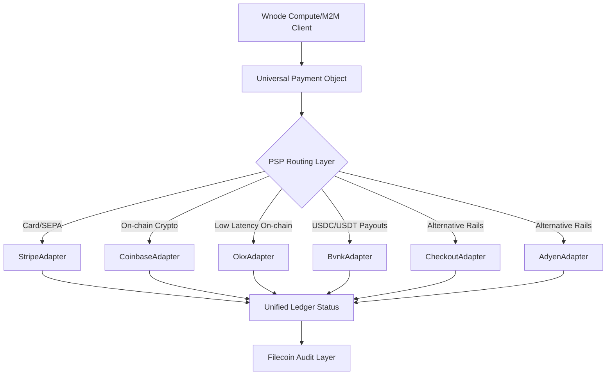

# Wnode Payments: Multi-PSP Abstraction Layer

This directory houses the core multi-PSP (Payment Service Provider) payments subsystem for Wnode, designed for machine-to-machine (M2M) compute payments and treasury routing.

## Architecture Overview

The system abstracts payment processing across multiple financial and crypto rails (credit cards, SEPA, on-chain crypto, stablecoin settlements) under a single, unified interface.



## Key Components

### 1. Universal Payment Object (UPO)
The `UniversalPaymentObject` (`upo.ts`) acts as the canonical data model representing a payment intent, transaction, or payout regardless of the underlying PSP. It normalizes states across cards and crypto:
- `PENDING`: Payment initialized.
- `PROCESSING`: Processing or captured pending settlement.
- `CAPTURED`: Settlement successful.
- `REFUNDED`: Funds returned to the machine/operator.
- `FAILED`: Payment failed.

### 2. PSP Adapter Interface (`PspAdapter`)
The generic interface (`core.ts`) that every payment provider must implement:
```typescript
export interface PspAdapter {
  name: string;
  createPayment(upo: UniversalPaymentObject): Promise<UniversalPaymentObject>;
  capturePayment(paymentId: string): Promise<UniversalPaymentObject>;
  refundPayment(paymentId: string, amount?: number): Promise<UniversalPaymentObject>;
  getPaymentStatus(paymentId: string): Promise<UniversalPaymentObject>;
}
```

### 3. Payment Router (`router.ts`)
Dynamically routes payment requests to the best-suited provider based on transaction parameters, metadata, or rails:
- **Stripe**: Handles traditional credit cards & SEPA.
- **Coinbase Business / OKX**: Handles on-chain crypto/stablecoin deposits.
- **BVNK**: Handles high-volume machine-to-machine payouts & treasury settlement.

### 4. Shared Webhook Reconciliation Core (`reconciliation.ts`)
Manages state transitions, ensures idempotent transaction processing, and runs background polling to catch and resolve discrepancies between the local ledger and payment provider states.

## Security & Auditability
Every successful transaction, capture, or refund event automatically anchors a canonical payment receipt onto the **Filecoin/IPFS Audit Layer**, providing cryptographically verifiable proof of payment (using BLAKE3 hashes and Ed25519 signatures).
