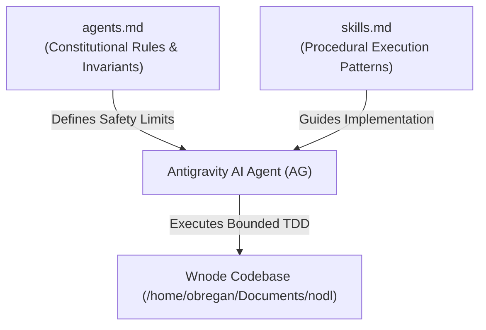

# Wnode Sovereign Agent Knowledge Base & Recursive Skill System (`skills.md`)

This document defines the structured, procedural execution skills and validated operational patterns for the Antigravity AI Coding Agent (AG) operating across the Wnode network architecture (`wnodeltd/wnode`).

---

## 1. System Governance & Invariant Alignment



- **`agents.md` (Constitutional Foundation)**: Establishes immutable boundaries, safety invariants, prohibited operations, allowed write directories, and TDD iteration limits.
- **`skills.md` (Operational Execution Patterns)**: Stores standardized procedural blueprints, diagnostic workflows, design patterns, and integration mechanics learned across execution cycles.

`skills.md` complements `agents.md` by elevating execution reliability and autonomy. It **never** modifies, overrides, or bypasses any rule in `agents.md`.

---

## 2. Category 100 — Core Diagnostic & TDD Execution Patterns

### SKILL-101: Non-Mutating Baseline Diagnostics & Crash-Chain Extraction
- **Objective**: Identify exact root causes before mutating source code or configuration files.
- **Procedure**:
  1. Observe baseline system state using code search and file inspection tools.
  2. Inspect layout wrappers, component boundaries, and module path aliases across failing routes.
  3. Trace API authentication pipelines and status codes (`401`, `403`, `500`).
  4. Isolate failing files, exact line numbers, and trigger conditions into a non-modifying diagnostic report before proceeding to remediation.

### SKILL-102: Bounded TDD Harness & Machine-Scannable Logging
- **Objective**: Execute code changes inside strict test-driven development cycles.
- **Procedure**:
  1. Write or update unit tests targeting the specific subsystem failure prior to production code edits.
  2. Limit remediation cycles to a maximum of 10 loops per task.
  3. Emit machine-scannable logs for every execution phase:
     ```text
     [PHASE <ID>] | [TARGET FILE/PACKAGE] | [STATUS] | [EXIT CODE]
     ```

### SKILL-103: Verification & Production Compilation Invariants
- **Objective**: Guarantee zero regressions and compile-level stability across all binaries.
- **Procedure**:
  1. Run Go unit test suite across modified packages (`/home/obregan/go/pkg/mod/.../bin/go test -v ./...`).
  2. Compile production daemon binary [`nodld_bin`](file:///home/obregan/Documents/nodl/nodld_bin) from `services/nodld/cmd/nodld`.
  3. Execute Next.js production build (`npm run build --prefix apps/command`) to verify static and dynamic route compilation.

---

## 3. Category 200 — Frontend Architecture & Next.js UI Rules

### SKILL-201: Canonical Shell Layout Wrapping
- **Objective**: Maintain global navigation, topbar, sidebar, and session context across all Command Portal views.
- **Procedure**:
  - Every page view inside `apps/command/app/*` (e.g. `/dewi`, `/operator/psp`, `/nodlrs`, `/ledger`) **must** import `Shell` and wrap its top-level JSX return tree inside `<Shell>`:
    ```tsx
    import Shell from '../components/Shell';
    export default function PageView() {
        return (
            <Shell>
                <div className="...">...</div>
            </Shell>
        );
    }
    ```

### SKILL-202: Module Boundary Resolution & `tsconfig` Path Aliases
- **Objective**: Prevent cross-package import resolution failures during Webpack compilation.
- **Procedure**:
  - Always use configured `tsconfig` path aliases for cross-package shared imports (e.g. `@shared/components/MetricCard`) rather than out-of-boundary relative paths (`../../../../apps/shared/...`).

### SKILL-203: Client-Side Hydration Protection
- **Objective**: Eliminate React SSR/CSR markup mismatches caused by browser local storage or window references.
- **Procedure**:
  - Wrap client-side session checks in a `mounted` boolean state hook:
    ```tsx
    const [mounted, setMounted] = useState(false);
    useEffect(() => setMounted(true), []);
    const userEmail = mounted ? localStorage.getItem("nodl_user_email") : null;
    ```

### SKILL-204: Graceful API Failure & Error Boundary Fallbacks
- **Objective**: Prevent silent UI rendering failures when backend APIs return HTTP errors.
- **Procedure**:
  - Evaluate HTTP status codes in client `fetch` calls and present explicit warning banners for `401 Unauthorized` or `403 Forbidden` responses rather than rendering unpopulated empty states.

---

## 4. Category 300 — Financial Ledger, Multi-PSP Routing & Memory Isolation

### SKILL-301: Multi-PSP Driver Abstraction & Dynamic Router
- **Objective**: Decouple payment processing from single-vendor lock-in.
- **Procedure**:
  - Define unified Go interface `PSPProvider` (`GetType()`, `GetHealth()`, `ExecutePayout()`, `ExecuteCharge()`, `ProcessWebhook()`).
  - Implement drivers for **Stripe**, **BVNK**, **Bridge**, **Coinbase**, **Adyen**, **OKX Pay**, and **Eco**.
  - Register drivers in `PSPRegistry` and execute payouts via `ExecutePayoutWithFallback` for automatic fallback routing.

### SKILL-302: HashiCorp Vault Volatile RAM Secret Isolation
- **Objective**: Eliminate persistent storage of sensitive payment credentials.
- **Procedure**:
  - Load production keys from Vault paths (`secret/data/psp/*`) directly into volatile driver struct memory at startup or on `POST /api/v1/admin/psp/rotate`.
  - Never write secrets to `engine.db`, log files (`zap.Logger`), environment dumps, or Git commits.
  - Provide a memory scrubbing function (`PurgeSecrets()`) for test fixture cleanup.

### SKILL-303: Sanitized API Metadata Responses
- **Objective**: Expose operational status to CMD dashboards without leaking secrets.
- **Procedure**:
  - Return sanitized JSON structs (`PSPStatusItem`) containing non-sensitive fields (`name`, `accountId`, `region`, `jurisdiction`, `status`, `latencyMs`, `settlementMode`).

### SKILL-304: 6-Tier Revenue Split Invariant Preservation
- **Objective**: Guarantee authoritative 100.0% revenue distribution across all conversion and payment rails.
- **Procedure**:
  - Strictly enforce revenue splits in `conversion.SwapEngine`:
    - `70.0%`: Nodlr Node Operator
    - `10.0%`: Direct Sales Source
    - `3.0%`: Level 1 Affiliate (L1)
    - `7.0%`: Level 2 Affiliate (L2)
    - `7.0%`: Steward Fee (Platform Operations & Treasury)
    - `3.0%`: Founder Lifelong Lineage (`100001-0426-01-AA`)

### SKILL-305: Micropayment Epoch Aggregation
- **Objective**: Prevent transaction fee erosion on sub-dollar compute rewards.
- **Procedure**:
  - Accumulate micro-earnings per WUID in `batcher.Aggregator`.
  - Defer payout dispatch until balance reaches threshold rules ($10.00 USD for micro/crypto rails; $50.00 USD for bank/ACH rails).

---

## 5. Category 400 — Multi-Chain Integration & Identity Verification

### SKILL-401: Structured WUID Component Decomposition
- **Objective**: Validate user identity and referral downlines deterministically.
- **Procedure**:
  - Decompose WUID strings (`Sequence-Batch-Slot-Checksum` e.g., `100001-0426-01-AA`) via `account.ParseWUID` using strict regex rules.

### SKILL-402: Multi-Chain Event Ingestion & Confirmation Guards
- **Objective**: Ingest cross-chain crypto deposits with attribution tags.
- **Procedure**:
  - Subscribe to deposit events across EVM (Ethereum, Base, Arbitrum), Solana, and Cosmos.
  - Enforce confirmation thresholds (12 block confirmations for EVM, 32 for L2s, 1 finalized status for Solana).

### SKILL-403: Proof Hash Idempotency & Replay Guard
- **Objective**: Prevent double-spending or duplicate settlement processing.
- **Procedure**:
  - Maintain a thread-safe `processedIDs` map to verify that transaction/proof hashes are processed exactly once.

### SKILL-404: Country Centroid Geolocation Fallback Pipeline
- **Objective**: Prevent unmapped or local IP node registrations from defaulting to an arbitrary map location (e.g. Budapest golden spiral).
- **Procedure**:
  - When GeoIP returns `(0, 0)` for local or unindexed node IP addresses, query `ResolveCountryCentroid(operator.Country)` against the operator's account/CRM country setting.
  - In frontend map renderers (`FleetMap.tsx`), resolve country centroid coordinates before resorting to default coordinates.

---

## 6. Category 500 — Governance & Jurisdictional Failover

### SKILL-501: Dual-Entity Legal Switcher
- **Objective**: Support zero-downtime legal entity transition without database migration.
- **Procedure**:
  - Manage entity profiles (**UK HoldCo** $\leftrightarrow$ **Dubai IFZA/VARA**) in `config.JurisdictionManager`, dynamically updating tax IDs, VAT numbers, bank codes, and active PSP platform keys.

### SKILL-502: 3-Tier RBAC Enforcement Chains
- **Objective**: Restrict administrative and financial configuration endpoints to authorized Owner roles.
- **Procedure**:
  1. Next.js Middleware Guard (client route check).
  2. React Component Guard (`<OwnerGuard>`).
  3. Go Server API Guard (`s.requireAccess(account.RoleManagement, "command")`).

### SKILL-503: Canonical Owner Role & Identity Propagation
- **Objective**: Ensure platform owners receive full Owner privileges and badge visibility across backend stores, CRM indexes, and client RBAC layouts.
- **Procedure**:
  - Seed anchor owner accounts with `Role: RoleOwner`, `IsOwner: true`, `IsFounder: true`, and `Labels: []string{"OWNER", "FOUNDER", ...}`.
  - Expose boolean flags `isOwner` and `isFounder` in public/admin API JSON payloads to guarantee CRM UI rendering and Sidebar navigation visibility.

---

## 7. Recursive Maintenance & System Protocol

### 7.1 Pattern Ingestion Protocol (When to Add New Skills)
AG will add a new skill to `skills.md` **only** when all of the following criteria are met:
1. The technical pattern has been executed and proven in code.
2. The implementation has passed 100% of unit test suites with exit code 0.
3. The production binary/web build compiles successfully with exit code 0.
4. The pattern represents a reusable procedural solution for future tasks.

### 7.2 Refinement & Normalization Protocol
AG will refine existing skills when:
- A cleaner or more performant implementation pattern replaces an existing skill.
- Multiple related skills can be normalized or consolidated to improve scannability.

### 7.3 Drift Prevention & Safety Rules
- **Zero Secrets / Zero Credentials**: Never include API keys, passwords, private keys, IP addresses, or personal tokens in `skills.md`.
- **Zero Overrides**: Never add patterns that contradict `agents.md`.
- **Determinism**: Maintain markdown structure and categorized numbering (`SKILL-XXX`).
